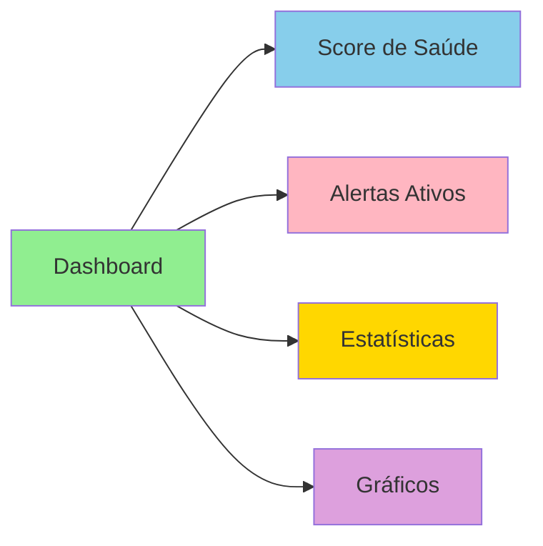
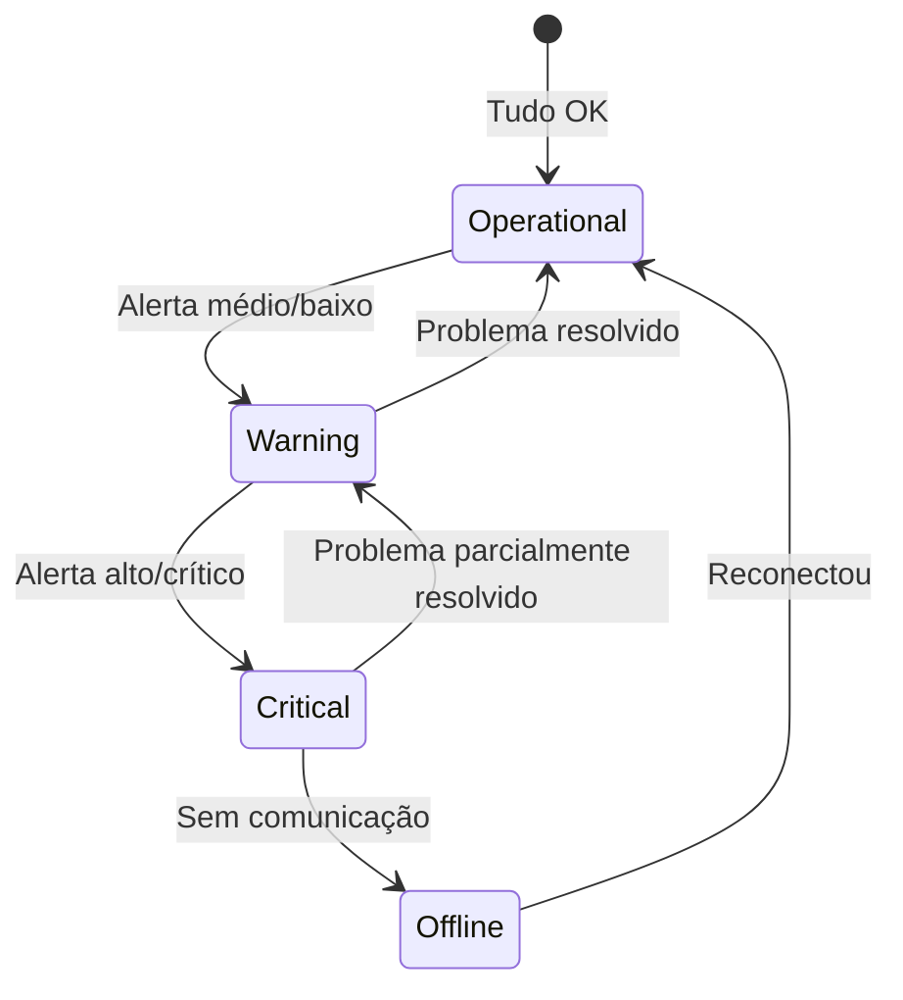
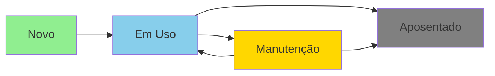
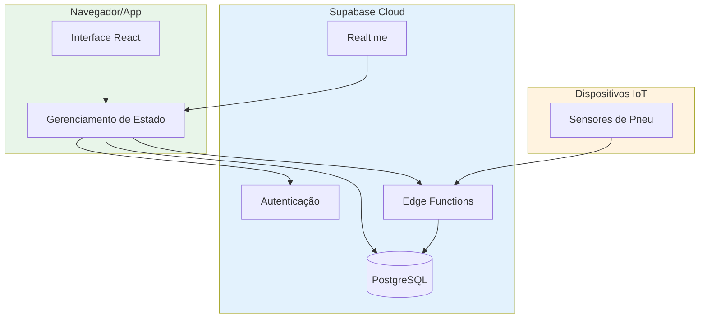
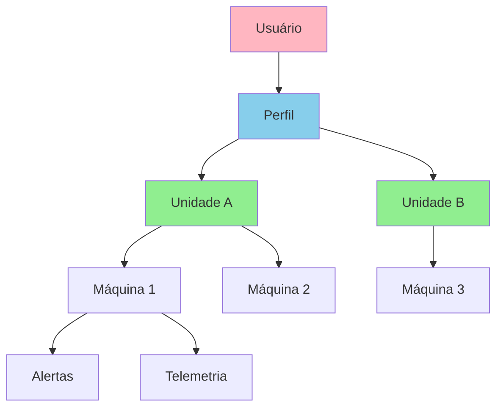

# Visão Geral do Sistema

## Introdução

O **TireWatch Pro** é uma plataforma SaaS (Software as a Service) de monitoramento de pneus para frotas de máquinas agrícolas e industriais. O sistema foi desenvolvido para ajudar empresas a gerenciar seus equipamentos de forma inteligente, coletando dados em tempo real e gerando alertas automáticos quando algo precisa de atenção.

### O que significa isso na prática?

Imagine que você tem uma fazenda com 50 tratores. Cada trator tem vários pneus que precisam estar com a pressão correta para funcionar bem. Sem o TireWatch Pro, você precisaria verificar manualmente cada pneu de cada trator - um trabalho demorado e sujeito a erros.

Com o TireWatch Pro:
- **Sensores** nos pneus enviam dados automaticamente para o sistema
- O sistema **analisa** esses dados em tempo real
- Se um pneu estiver com pressão baixa, você recebe um **alerta** imediatamente
- Você pode ver tudo em um **painel de controle** (dashboard) no computador ou celular

## Propósito

Este sistema foi desenvolvido para:

- **Centralizar** o monitoramento de toda a frota em um único lugar
- **Prevenir** problemas antes que causem danos maiores
- **Automatizar** a detecção de anomalias (pressão baixa, velocidade excessiva)
- **Reduzir custos** com manutenção corretiva e paradas não planejadas
- **Aumentar a segurança** dos operadores e equipamentos

## Contexto de Negócio

O sistema atende às necessidades de organizações que precisam:

- Monitorar pressão e velocidade de pneus em tempo real
- Receber alertas automáticos quando algo está fora do normal
- Gerenciar múltiplas unidades operacionais (fazendas, filiais, etc.)
- Controlar acesso de diferentes tipos de usuários (admin, gestor, técnico, operador)
- Manter histórico de ocorrências e manutenções
- Gerar relatórios e análises para tomada de decisão

## Principais Funcionalidades

### 1. Dashboard Principal

O dashboard é a "tela inicial" do sistema, onde você vê um resumo de tudo que está acontecendo.

**O que você encontra aqui:**
- **Score de Saúde da Frota**: Uma nota de 0 a 100 que indica como está a frota em geral
- **Alertas Ativos**: Quantos problemas precisam de atenção agora
- **Estatísticas de Máquinas**: Quantas estão operando normalmente, com aviso ou críticas
- **Gráficos de Tendência**: Como a pressão dos pneus variou ao longo do tempo

### 2. Centro de Comando (Command Center)

O Centro de Comando é onde você gerencia todos os alertas do sistema. Pense nele como uma "central de emergências" para sua frota.

**Funcionalidades:**
- **Lista de Alertas**: Todos os problemas organizados por prioridade
- **Sistema de SLA**: Contador regressivo mostrando quanto tempo você tem para resolver cada alerta
- **Filtros Avançados**: Filtrar por severidade (crítico, alto, médio, baixo), tipo de problema, status
- **Feed ao Vivo**: Atualizações em tempo real quando novos alertas surgem

**Níveis de Severidade:**
| Nível | Cor | Significado | Exemplo |
|-------|-----|-------------|---------|
| **Crítico** | 🔴 Vermelho | Requer ação imediata | Pressão muito baixa (< 2.0 bar) |
| **Alto** | 🟠 Laranja | Atenção urgente | Pressão baixa (< 2.5 bar) |
| **Médio** | 🟡 Amarelo | Monitorar de perto | Pressão levemente baixa |
| **Baixo** | 🟢 Verde | Informativo | Pequena variação de pressão |

### 3. Gestão de Máquinas

Aqui você gerencia todas as máquinas da sua frota.

**O que você pode fazer:**
- Ver lista de todas as máquinas
- Filtrar por unidade (fazenda/filial)
- Ver status de cada máquina (operacional, aviso, crítico, offline)
- Acessar detalhes e histórico de cada máquina
- Ver telemetria em tempo real (pressão, velocidade)

**Status das Máquinas:**

### 4. Gestão de Pneus

Controle completo do ciclo de vida dos pneus.

**Funcionalidades:**
- Cadastro de pneus com número de série único
- Rastreamento de posição (dianteiro esquerdo, dianteiro direito, etc.)
- Status do ciclo de vida (novo, em uso, manutenção, aposentado)
- Histórico de pressão e calibração
- Análise de deformação

**Ciclo de Vida do Pneu:**

### 5. Telemetria em Tempo Real

O coração do sistema - coleta e processamento de dados dos sensores.

**Como funciona:**
1. **Sensores** nos pneus medem pressão e velocidade
2. **Dados são enviados** para o sistema via API
3. **Sistema analisa** os dados automaticamente
4. **Alertas são gerados** se algo estiver fora do normal
5. **Dashboard atualiza** em tempo real via WebSocket

**Regras de Alerta Automático:**
| Condição | Tipo de Alerta | Severidade |
|----------|----------------|------------|
| Pressão < 2.0 bar | Pressão Baixa | Crítico |
| Pressão < 2.5 bar | Pressão Baixa | Alto |
| Pressão > 5.0 bar | Pressão Alta | Crítico |
| Velocidade > 80 km/h | Velocidade Excedida | Crítico |

### 6. Análise e Business Intelligence

Ferramentas para análise de dados e tomada de decisão.

**Recursos:**
- **Analytics Avançados**: Gráficos de tendência, distribuição de alertas (`/analytics`)
- **Business Intelligence**: KPIs, métricas de performance (`/bi`)
- **Gestão de Custos**: Quanto você está gastando com manutenção (`/costs`)
- **Insights de IA**: Previsões e recomendações geradas por inteligência artificial

### 6.1 Análises Especializadas de Pneus

O sistema oferece análises detalhadas para cada aspecto dos pneus:

- **Calibração** (`/calibration`): Monitoramento de calibragem com alertas automáticos
- **Deformação** (`/deformation`): Detecção de problemas estruturais nos pneus
- **Desgaste** (`/wear`): Análise de padrões de desgaste e previsão de vida útil
- **Lastro de Fluido** (`/fluid`): Monitoramento de lastro líquido em pneus agrícolas
- **Análise de Carga** (`/load`): Distribuição de peso e impacto nos pneus

### 7. Geolocalização

Veja onde suas máquinas estão no mapa.

**Funcionalidades:**
- Mapa interativo com posição de cada máquina
- Filtros por status e unidade
- Visualização de rotas
- Zoom e navegação intuitivos

### 8. Ocorrências

Registro de incidentes e manutenções.

**O que você pode fazer:**
- Registrar ocorrências com descrição detalhada (`/occurrences/new`)
- Anexar fotos, áudios e vídeos
- Acompanhar status de resolução (`/occurrences`)
- Funciona offline (sincroniza quando voltar a ter internet)

### 9. Dispositivos IoT

Gestão dos sensores instalados nas máquinas e pneus.

**Funcionalidades:**
- Lista de todos os dispositivos cadastrados (`/devices`)
- Cadastro de novos sensores (`/devices/new`)
- Monitoramento de status de comunicação
- Configuração remota de parâmetros
- Histórico de operação por dispositivo

### 10. Operações de Equipe

Gestão de tarefas e atividades da equipe operacional.

**O que você pode fazer:**
- Atribuir tarefas a funcionários (`/team-operations`)
- Acompanhar progresso de atividades
- Feed de atividades da equipe
- Filtros por status e prioridade

## Stack Tecnológica

### O que é "Stack Tecnológica"?

Stack tecnológica é o conjunto de tecnologias (linguagens, frameworks, ferramentas) usadas para construir o sistema. Pense como os "ingredientes" de uma receita.

### Frontend (Interface do Usuário)

O frontend é tudo que você vê e interage - botões, formulários, gráficos, etc.

| Tecnologia | Versão | Para que serve |
|------------|--------|----------------|
| **React** | 18.3.1 | Biblioteca para construir interfaces. Permite criar componentes reutilizáveis. |
| **TypeScript** | 5.8.3 | Linguagem que adiciona "tipos" ao JavaScript, ajudando a evitar erros. |
| **Vite** | 5.4.19 | Ferramenta que "compila" o código e cria o servidor de desenvolvimento. |
| **React Router** | 6.30.1 | Gerencia a navegação entre páginas (ex: /dashboard, /machines). |
| **TanStack Query** | 5.83.0 | Gerencia dados do servidor (cache, atualização, sincronização). |
| **React Hook Form** | 7.61.1 | Facilita a criação de formulários. |
| **Zod** | 3.25.76 | Valida dados (ex: verificar se email é válido). |

### UI/Design System (Aparência)

| Tecnologia | Versão | Para que serve |
|------------|--------|----------------|
| **Tailwind CSS** | 3.4.17 | Framework de CSS que usa classes utilitárias (ex: `bg-blue-500`). |
| **shadcn/ui** | - | Coleção de componentes prontos (botões, cards, modais). |
| **Radix UI** | Múltiplos | Componentes acessíveis e sem estilo (base para shadcn/ui). |
| **Lucide React** | 0.462.0 | Biblioteca de ícones. |
| **Framer Motion** | 12.24.7 | Animações suaves e profissionais. |

### Visualização de Dados

| Tecnologia | Versão | Para que serve |
|------------|--------|----------------|
| **Recharts** | 2.15.4 | Biblioteca para criar gráficos (linhas, barras, pizza). |
| **Mapbox GL** | 3.17.0 | Mapas interativos de alta qualidade. |

### Backend (Servidor)

O backend é a parte "invisível" que processa dados, armazena informações e aplica regras de negócio.

| Componente | Para que serve |
|------------|----------------|
| **Supabase** | Plataforma completa de backend (banco de dados, autenticação, APIs). |
| **PostgreSQL** | Banco de dados relacional onde os dados são armazenados. |
| **Edge Functions** | Funções serverless (código que roda no servidor sem você gerenciar servidores). |
| **Realtime** | Atualizações em tempo real via WebSocket. |
| **Row Level Security** | Segurança que controla quem pode ver/editar cada dado. |

## Arquitetura de Alto Nível

## Modelo Multi-Tenant

### O que é Multi-Tenant?

Multi-tenant significa que o mesmo sistema serve várias "organizações" (tenants), mas cada uma só vê seus próprios dados. É como um prédio de apartamentos - todos usam o mesmo prédio, mas cada um só acessa seu próprio apartamento.

### Como funciona no TireWatch Pro:

- **Units (Unidades)**: Cada fazenda, filial ou centro de operação é uma "unidade"
- **Profiles (Perfis)**: Cada usuário tem acesso a uma ou mais unidades
- **Machines (Máquinas)**: Cada máquina pertence a uma unidade
- **Isolamento de Dados**: Usuário só vê dados das unidades que tem acesso

### Hierarquia de Permissões (Roles)

| Role | Nível | O que pode fazer |
|------|-------|------------------|
| **Admin** | 4 | Tudo - gerencia usuários, configurações, todas as unidades |
| **Manager** | 3 | Gerencia unidades e equipes, vê relatórios |
| **Technician** | 2 | Realiza manutenções, calibrações, resolve alertas |
| **Operator** | 1 | Operação diária, registra ocorrências |

## Requisitos de Sistema

### Para Usar o Sistema (Usuário Final)

- **Navegador moderno**: Chrome, Firefox, Safari ou Edge (versões recentes)
- **Conexão com internet**: Necessária para acessar o sistema
- **Resolução mínima**: 1280x720 pixels (funciona em celulares também)

### Para Desenvolver

- **Node.js**: Versão 18 ou superior
- **npm**: Versão 9 ou superior (vem junto com Node.js)
- **Git**: Para controle de versão
- **Editor de código**: VS Code recomendado

## URLs de Acesso

| Ambiente | URL | Descrição |
|----------|-----|-----------|
| **Desenvolvimento** | http://localhost:8080 | Servidor local para desenvolvimento |
| **Produção** | (URL do Lovable.dev) | Ambiente de produção |

## Integrações

### IoT/Telemetria

Os sensores de pneu enviam dados para o sistema através de uma API:

- **Endpoint**: `POST /functions/v1/telemetry-ingest`
- **Autenticação**: API Key ou JWT
- **Formato**: JSON com pressão, velocidade e identificação da máquina
- **Capacidade**: Até 1000 leituras por requisição

### Inteligência Artificial

O sistema usa IA para gerar insights e previsões:

- **Modelo**: Google Gemini 2.5 Flash
- **Tipos de análise**: Insights gerais, previsões, detecção de anomalias, recomendações
- **Integração**: Via Lovable AI Gateway

## Próximos Passos

Para começar a trabalhar com o sistema:

1. Consulte o [Guia de Desenvolvimento](13-GUIA-DESENVOLVIMENTO.md) para configurar o ambiente
2. Leia sobre a [Arquitetura](02-ARQUITETURA.md) para entender a estrutura
3. Explore a [API Reference](12-API-REFERENCE.md) para conhecer os endpoints
4. Veja os [Componentes](04-COMPONENTES.md) para entender a interface

## Suporte e Documentação

- **Documentação Técnica**: Você está aqui! 📚
- **Código-fonte**: Pasta `/src` do projeto
- **Supabase Dashboard**: Para gerenciar banco de dados e funções

---

**Versão do Sistema**: 2.0  
**Última Atualização**: 12/Janeiro/2026  
**Framework**: React 18 + TypeScript + Vite  
**Backend**: Supabase (PostgreSQL + Edge Functions)  
**Módulos**: 10 módulos funcionais | 24+ rotas | 200+ componentes
