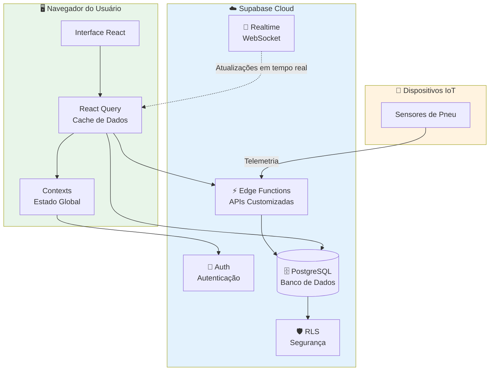
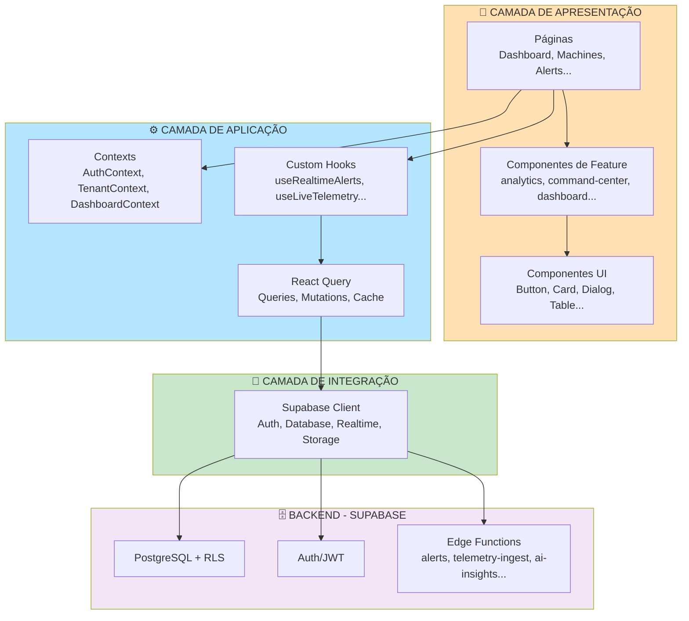
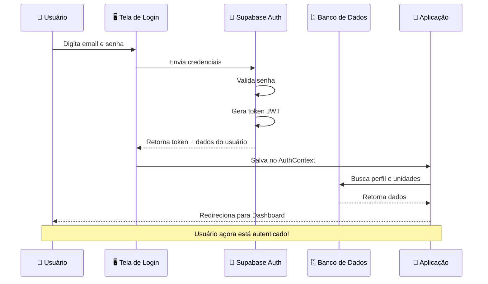
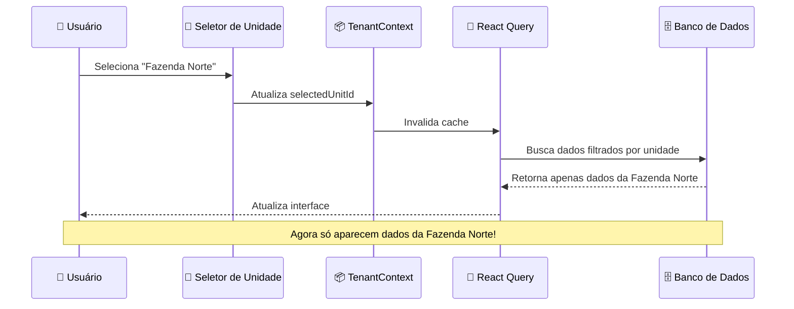
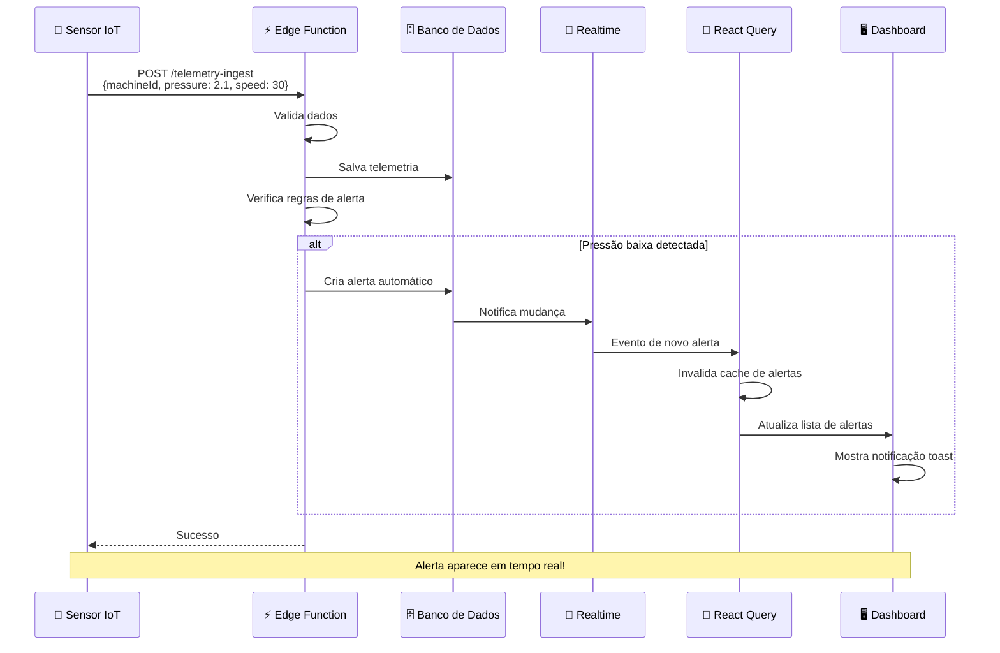
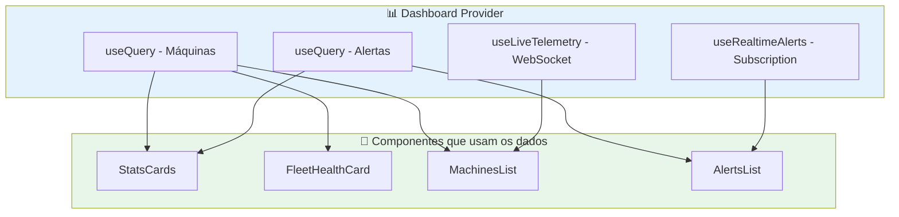

# Arquitetura do Sistema

## Introdução

O **TireWatch Pro** foi desenvolvido seguindo uma arquitetura moderna chamada **Frontend SPA + Backend-as-a-Service (BaaS)**. Isso significa que temos uma aplicação React que roda no navegador do usuário (frontend) e usa o Supabase como plataforma de backend completa.

### O que isso significa na prática?

Imagine uma casa:
- **Frontend (React)** = A parte visível da casa (paredes, móveis, decoração)
- **Backend (Supabase)** = A infraestrutura invisível (encanamento, eletricidade, fundação)

O usuário interage com o frontend, que por sua vez se comunica com o backend para buscar e salvar dados.

## Visão Geral da Arquitetura



## Padrão Arquitetural

### Tipo: Layered Architecture (Arquitetura em Camadas)

A aplicação é organizada em "camadas", onde cada camada tem uma responsabilidade específica. Pense como um bolo de várias camadas - cada camada é diferente, mas juntas formam o bolo completo.



### Explicando cada camada:

#### 1. Camada de Apresentação (O que o usuário vê)

Esta camada contém tudo que aparece na tela:

- **Páginas**: Telas completas como Dashboard, Lista de Máquinas, Centro de Comando
- **Componentes de Feature**: Partes específicas de cada funcionalidade (cards de alerta, gráficos, filtros)
- **Componentes UI**: Elementos básicos reutilizáveis (botões, inputs, modais)

#### 2. Camada de Aplicação (A lógica do sistema)

Esta camada gerencia como os dados fluem e são processados:

- **Contexts**: Guardam informações globais (usuário logado, unidade selecionada)
- **Custom Hooks**: Funções reutilizáveis que encapsulam lógica (buscar alertas, atualizar em tempo real)
- **React Query**: Gerencia cache e sincronização de dados com o servidor

#### 3. Camada de Integração (A ponte com o backend)

Esta camada faz a comunicação com o Supabase:

- **Supabase Client**: Biblioteca que facilita a comunicação com todos os serviços do Supabase

#### 4. Backend (Onde os dados vivem)

Esta camada está no Supabase Cloud:

- **PostgreSQL**: Banco de dados onde tudo é armazenado
- **Auth/JWT**: Sistema de login e controle de acesso
- **Edge Functions**: APIs customizadas para lógica complexa

## Fluxo de Dados

### 1. Fluxo de Autenticação (Login)

Quando um usuário faz login, acontece o seguinte:



**Explicando passo a passo:**
1. Usuário digita email e senha na tela de login
2. Sistema envia para o Supabase Auth verificar
3. Se correto, Supabase gera um "token" (como um crachá digital)
4. Aplicação guarda esse token e busca mais informações do usuário
5. Usuário é redirecionado para o Dashboard

### 2. Fluxo de Multi-Tenancy (Seleção de Unidade)

Quando o usuário seleciona uma unidade diferente:



**Explicando:**
1. Usuário escolhe uma unidade no seletor
2. Sistema atualiza qual unidade está selecionada
3. Todas as consultas são refeitas filtrando pela nova unidade
4. Interface atualiza mostrando apenas dados daquela unidade

### 3. Fluxo de Telemetria em Tempo Real

Quando um sensor de pneu envia dados:



**Explicando:**
1. Sensor envia dados de pressão e velocidade
2. Edge Function recebe e valida os dados
3. Dados são salvos no banco
4. Sistema verifica se há algum problema (ex: pressão muito baixa)
5. Se houver problema, cria um alerta automaticamente
6. Alerta aparece instantaneamente no dashboard do usuário

### 4. Fluxo do Dashboard Context

O DashboardContext centraliza dados que várias partes da tela precisam:



## Componentes de Arquitetura

### Contexts (Estado Global)

Contexts são como "variáveis globais" que qualquer parte da aplicação pode acessar.

| Context | O que guarda | Exemplo de uso |
|---------|--------------|----------------|
| **AuthContext** | Dados do usuário logado, funções de login/logout | Verificar se usuário está autenticado |
| **TenantContext** | Unidades do usuário, unidade selecionada | Filtrar dados por unidade |
| **DashboardContext** | Dados agregados de máquinas, alertas, telemetria | Mostrar estatísticas no dashboard |

### Custom Hooks (Lógica Reutilizável)

Hooks são funções que encapsulam lógica complexa para ser reutilizada.

| Hook | O que faz | Quando usar |
|------|-----------|-------------|
| **useRealtimeAlerts** | Escuta novos alertas via WebSocket | Atualizar lista de alertas em tempo real |
| **useRealtimeMachines** | Escuta mudanças em máquinas | Atualizar status de máquinas |
| **useLiveTelemetry** | Recebe telemetria em tempo real | Mostrar pressão atual nos gráficos |
| **useOperationalDashboard** | Busca dados do dashboard | Montar a tela principal |
| **useBusinessIntelligence** | Busca métricas de BI | Gerar relatórios e análises |
| **useAIInsights** | Busca insights de IA | Mostrar previsões e recomendações |
| **useCostManagement** | Calcula custos de manutenção | Relatórios financeiros |
| **useFleetManagement** | Gerencia dados da frota | Tela de gestão de frota |
| **useTireCalibration** | Gerencia calibração de pneus | Tela de calibração |

### Edge Functions (APIs no Servidor)

Edge Functions são código que roda no servidor do Supabase.

| Function | Método | Para que serve |
|----------|--------|----------------|
| **alerts** | GET | Buscar alertas com filtros avançados |
| **telemetry-ingest** | POST | Receber dados dos sensores IoT |
| **ai-insights** | POST | Gerar análises com inteligência artificial |
| **occurrences** | GET/POST | Gerenciar ocorrências |
| **alert-actions** | POST | Executar ações em alertas (resolver, reconhecer) |
| **machine-timeline** | GET | Buscar histórico de eventos de uma máquina |

## Padrões de Design Implementados

### 1. Container/Presentational Pattern

Separamos componentes em dois tipos:

- **Container (Página)**: Busca dados e gerencia estado
- **Presentational (Componente)**: Apenas renderiza o que recebe

```typescript
// Container (Página) - Busca os dados
function MachinesPage() {
  const { machines, isLoading } = useMachines();
  return <MachinesList machines={machines} loading={isLoading} />;
}

// Presentational (Componente) - Só mostra os dados
function MachinesList({ machines, loading }) {
  if (loading) return <Skeleton />;
  return machines.map(m => <MachineCard key={m.id} machine={m} />);
}
```

**Por que isso é bom?**
- Componentes presentational são mais fáceis de testar
- Podem ser reutilizados em diferentes contextos
- Código mais organizado e fácil de entender

### 2. Custom Hook Pattern

Encapsulamos lógica complexa em hooks reutilizáveis:

```typescript
// Hook que encapsula toda a lógica de alertas em tempo real
function useRealtimeAlerts() {
  const queryClient = useQueryClient();
  
  useEffect(() => {
    // Cria conexão WebSocket com o Supabase
    const channel = supabase
      .channel('alerts-realtime')
      .on('postgres_changes', { event: '*', table: 'alerts' }, () => {
        // Quando algo muda, atualiza o cache
        queryClient.invalidateQueries({ queryKey: ['alerts'] });
        // Mostra notificação para o usuário
        toast.warning('Novo Alerta!');
      })
      .subscribe();
    
    // Limpa a conexão quando o componente é desmontado
    return () => supabase.removeChannel(channel);
  }, [queryClient]);
}
```

**Por que isso é bom?**
- Lógica pode ser reutilizada em vários componentes
- Fácil de testar isoladamente
- Mantém os componentes mais simples

### 3. Provider Pattern

Usamos Providers para compartilhar dados entre componentes:

```typescript
// App.tsx - Hierarquia de providers
<QueryClientProvider>      {/* Cache de dados */}
  <AuthProvider>           {/* Autenticação */}
    <TenantProvider>       {/* Multi-tenancy */}
      <DashboardProvider>  {/* Dados do dashboard */}
        <Routes />         {/* Páginas da aplicação */}
      </DashboardProvider>
    </TenantProvider>
  </AuthProvider>
</QueryClientProvider>
```

**Por que isso é bom?**
- Qualquer componente pode acessar os dados que precisa
- Evita "prop drilling" (passar dados por muitos níveis)
- Centraliza a lógica de gerenciamento de estado

### 4. Optimistic Updates

Atualizamos a interface ANTES de confirmar com o servidor:

```typescript
// Quando usuário resolve um alerta
useMutation({
  mutationFn: resolveAlert,
  onMutate: async (alertId) => {
    // 1. Cancela queries em andamento
    await queryClient.cancelQueries({ queryKey: ['alerts'] });
    
    // 2. Salva estado anterior (para rollback se der erro)
    const previous = queryClient.getQueryData(['alerts']);
    
    // 3. Atualiza interface IMEDIATAMENTE (otimista)
    queryClient.setQueryData(['alerts'], (old) => 
      old.map(a => a.id === alertId ? { ...a, status: 'resolved' } : a)
    );
    
    return { previous };
  },
  onError: (err, alertId, context) => {
    // Se deu erro, volta ao estado anterior
    queryClient.setQueryData(['alerts'], context.previous);
    toast.error('Erro ao resolver alerta');
  },
  onSettled: () => {
    // Busca dados atualizados do servidor
    queryClient.invalidateQueries({ queryKey: ['alerts'] });
  },
});
```

**Por que isso é bom?**
- Interface parece mais rápida para o usuário
- Melhor experiência de uso
- Se der erro, volta ao estado anterior automaticamente

## Segurança

### Row Level Security (RLS)

RLS é uma funcionalidade do PostgreSQL que controla quem pode ver/editar cada linha do banco de dados.

**Como funciona:**
1. Cada tabela tem "políticas" de segurança
2. Quando alguém faz uma query, o banco verifica as políticas
3. Só retorna dados que o usuário tem permissão de ver

**Exemplo de política:**
```sql
-- Usuário só pode ver máquinas das unidades que tem acesso
CREATE POLICY "Usuários veem máquinas de suas unidades"
ON machines FOR SELECT
USING (
  unit_id IN (SELECT unnest(unit_ids) FROM profiles WHERE user_id = auth.uid())
);
```

### Validação de Input

Validamos dados em múltiplos níveis:

| Nível | Tecnologia | Exemplo |
|-------|------------|---------|
| **Frontend** | Zod + React Hook Form | Verificar se email é válido antes de enviar |
| **Edge Functions** | Zod | Validar dados recebidos da API |
| **Database** | Constraints | Garantir que email é único |

## Performance

### Estratégias de Cache

| Recurso | Stale Time | Refetch Interval | Explicação |
|---------|------------|------------------|------------|
| Machines | 30s | 60s | Dados mudam pouco, cache mais longo |
| Alerts | 15s | 30s | Precisam estar mais atualizados |
| Telemetry | 0 | Realtime | Sempre em tempo real via WebSocket |

**O que significa:**
- **Stale Time**: Quanto tempo os dados são considerados "frescos"
- **Refetch Interval**: De quanto em quanto tempo buscar novos dados

### Otimizações

1. **React Query Deduplication**: Se dois componentes pedem os mesmos dados, só faz uma requisição
2. **Realtime Subscriptions**: Só recebe dados que mudaram, não precisa buscar tudo de novo
3. **Pagination**: Limita quantidade de registros por página (50-500)
4. **Lazy Loading**: Componentes pesados só carregam quando necessário

## Deployment

### Ambiente de Desenvolvimento

```bash
npm run dev    # Inicia servidor em localhost:8080
```

### Ambiente de Produção

- **Frontend**: Hospedado no Lovable.dev
- **Backend**: Supabase Cloud
- **Edge Functions**: Deno Deploy (gerenciado pelo Supabase)

### Variáveis de Ambiente

```env
VITE_SUPABASE_URL=https://xxx.supabase.co
VITE_SUPABASE_PUBLISHABLE_KEY=eyJxxx...
```

## Dependências Externas

| Serviço | Para que serve |
|---------|----------------|
| **Supabase** | Backend completo (banco, auth, APIs, realtime) |
| **Mapbox** | Mapas e geolocalização |
| **Lovable AI Gateway** | Integração com modelos de IA |

## Próximos Passos

- [Frontend React](03-FRONTEND.md) - Detalhes sobre estrutura do frontend
- [Componentes](04-COMPONENTES.md) - Inventário completo de componentes
- [Supabase](05-SUPABASE.md) - Detalhes sobre o backend
- [API](06-API.md) - Documentação das Edge Functions
