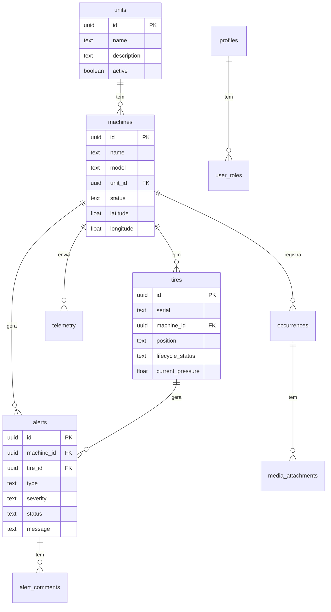

# Banco de Dados

## Introdução

O TireWatch Pro utiliza **PostgreSQL** como banco de dados, hospedado no Supabase. O banco contém 12 tabelas principais organizadas em domínios funcionais.

### O que é PostgreSQL?

PostgreSQL é um banco de dados relacional - os dados são organizados em tabelas com linhas e colunas, e as tabelas se relacionam entre si através de chaves.

## Diagrama de Relacionamentos



## Tabelas Principais

### units (Unidades)

Representa unidades operacionais (fazendas, filiais, centros de operação).

| Coluna | Tipo | Descrição |
|--------|------|-----------|
| `id` | uuid | Identificador único |
| `name` | text | Nome da unidade |
| `description` | text | Descrição opcional |
| `active` | boolean | Se está ativa |
| `created_at` | timestamptz | Data de criação |
| `updated_at` | timestamptz | Última atualização |

**Exemplo de dados:**
```json
{
  "id": "123e4567-e89b-12d3-a456-426614174000",
  "name": "Fazenda Norte",
  "description": "Unidade principal de produção",
  "active": true
}
```

### machines (Máquinas)

Máquinas da frota (tratores, colheitadeiras, etc.).

| Coluna | Tipo | Descrição |
|--------|------|-----------|
| `id` | uuid | Identificador único |
| `name` | text | Nome/identificador |
| `model` | text | Modelo da máquina |
| `unit_id` | uuid | FK → units.id |
| `status` | text | operational/warning/critical/offline |
| `image_url` | text | URL da imagem |
| `latitude` | double | Última latitude |
| `longitude` | double | Última longitude |
| `last_telemetry_at` | timestamptz | Última telemetria |

**Status possíveis:**
- `operational` - Funcionando normalmente
- `warning` - Alerta de atenção
- `critical` - Situação crítica
- `offline` - Sem comunicação

### tires (Pneus)

Pneus instalados ou em estoque.

| Coluna | Tipo | Descrição |
|--------|------|-----------|
| `id` | uuid | Identificador único |
| `serial` | text | Número de série (único) |
| `machine_id` | uuid | FK → machines.id (null = estoque) |
| `position` | text | Posição (FE, FD, TE, TD) |
| `lifecycle_status` | text | new/in_use/maintenance/retired |
| `current_pressure` | double | Pressão atual (bar) |
| `recommended_pressure` | double | Pressão recomendada |
| `installed_at` | timestamptz | Data de instalação |

**Posições:**
- `FE` - Frontal Esquerdo
- `FD` - Frontal Direito
- `TE` - Traseiro Esquerdo
- `TD` - Traseiro Direito

### alerts (Alertas)

Alertas gerados pelo sistema de monitoramento.

| Coluna | Tipo | Descrição |
|--------|------|-----------|
| `id` | uuid | Identificador único |
| `machine_id` | uuid | FK → machines.id |
| `tire_id` | uuid | FK → tires.id |
| `type` | text | Tipo do alerta |
| `severity` | text | low/medium/high/critical |
| `status` | text | open/acknowledged/in_progress/resolved |
| `message` | text | Mensagem do alerta |
| `reason` | text | Razão do alerta |
| `probable_cause` | text | Causa provável (IA) |
| `recommended_action` | text | Ação recomendada |
| `acknowledged_by` | uuid | Quem reconheceu |
| `opened_at` | timestamptz | Quando foi aberto |

**Tipos de alerta:**
- `pressure_low` - Pressão baixa
- `pressure_high` - Pressão alta
- `speed_exceeded` - Velocidade excedida
- `no_signal` - Sem sinal
- `anomaly` - Anomalia detectada

### telemetry (Telemetria)

Leituras de telemetria dos dispositivos IoT.

| Coluna | Tipo | Descrição |
|--------|------|-----------|
| `id` | uuid | Identificador único |
| `machine_id` | uuid | FK → machines.id |
| `tire_id` | uuid | FK → tires.id |
| `pressure` | double | Pressão (bar) |
| `speed` | double | Velocidade (km/h) |
| `seq` | integer | Sequência do dispositivo |
| `timestamp` | timestamptz | Timestamp da leitura |

### occurrences (Ocorrências)

Registros de incidentes e manutenções.

| Coluna | Tipo | Descrição |
|--------|------|-----------|
| `id` | uuid | Identificador único |
| `machine_id` | uuid | FK → machines.id |
| `tire_id` | uuid | FK → tires.id |
| `alert_id` | uuid | FK → alerts.id |
| `created_by` | uuid | Quem criou |
| `description` | text | Descrição |
| `status` | text | Status da ocorrência |
| `is_offline_created` | boolean | Se foi criada offline |
| `synced_at` | timestamptz | Quando sincronizou |

### profiles (Perfis)

Perfis de usuário.

| Coluna | Tipo | Descrição |
|--------|------|-----------|
| `id` | uuid | Identificador único |
| `user_id` | uuid | FK → auth.users.id |
| `name` | text | Nome do usuário |
| `email` | text | Email |
| `avatar_url` | text | URL do avatar |
| `unit_ids` | uuid[] | Array de unidades com acesso |

### user_roles (Roles de Usuário)

Roles de usuário para controle de acesso.

| Coluna | Tipo | Descrição |
|--------|------|-----------|
| `id` | uuid | Identificador único |
| `user_id` | uuid | FK → auth.users.id |
| `role` | app_role | admin/manager/technician/operator |

## Tipos Enumerados

### app_role

```sql
CREATE TYPE app_role AS ENUM ('admin', 'manager', 'technician', 'operator');
```

## Funções do Banco

### get_user_unit_ids(user_id)

Retorna array de unit_ids do usuário.

```sql
SELECT get_user_unit_ids(auth.uid());
-- Retorna: {uuid1, uuid2, uuid3}
```

### has_role(role, user_id)

Verifica se usuário tem determinada role.

```sql
SELECT has_role('admin', auth.uid());
-- Retorna: true ou false
```

### user_has_unit_access(unit_id, user_id)

Verifica se usuário tem acesso a uma unidade.

```sql
SELECT user_has_unit_access('uuid-da-unidade', auth.uid());
-- Retorna: true ou false
```

## Migrations

O projeto possui 14 migrations em `supabase/migrations/`:

1. Criação de tabelas base (units, machines, tires)
2. Alertas e telemetria
3. Ocorrências e mídia
4. Profiles e roles
5. Analytics e audit
6. Políticas RLS
7. Functions e triggers

### Executar Migrations

```bash
# Via Supabase CLI
supabase db push

# Ou via Dashboard do Supabase
```

## Tipos TypeScript

Os tipos são gerados automaticamente em `src/integrations/supabase/types.ts`:

```typescript
// Tipo de uma linha da tabela
type Machine = Tables<'machines'>;

// Tipo para inserção
type NewMachine = TablesInsert<'machines'>;

// Tipo para atualização
type UpdateMachine = TablesUpdate<'machines'>;
```

### Tipos Customizados

```typescript
// src/types/index.ts

export type UserRole = 'admin' | 'manager' | 'technician' | 'operator';
export type MachineStatus = 'operational' | 'warning' | 'critical' | 'offline';
export type TireLifecycleStatus = 'new' | 'in_use' | 'maintenance' | 'retired';
export type AlertSeverity = 'low' | 'medium' | 'high' | 'critical';
export type AlertStatus = 'open' | 'acknowledged' | 'in_progress' | 'resolved';
```

## Índices

Índices importantes para performance:

```sql
-- Máquinas por unidade
CREATE INDEX machines_unit_id_idx ON machines(unit_id);

-- Alertas por status e severidade
CREATE INDEX alerts_status_idx ON alerts(status);
CREATE INDEX alerts_severity_idx ON alerts(severity);
CREATE INDEX alerts_opened_at_idx ON alerts(opened_at DESC);

-- Telemetria por máquina e timestamp
CREATE INDEX telemetry_machine_id_idx ON telemetry(machine_id);
CREATE INDEX telemetry_timestamp_idx ON telemetry(timestamp DESC);
```

## Próximos Passos

- [Autenticação](07-AUTENTICACAO.md) - RLS e políticas de segurança
- [API](06-API.md) - Como acessar os dados via API
- [Guia de Desenvolvimento](13-GUIA-DESENVOLVIMENTO.md) - Trabalhando com o banco
