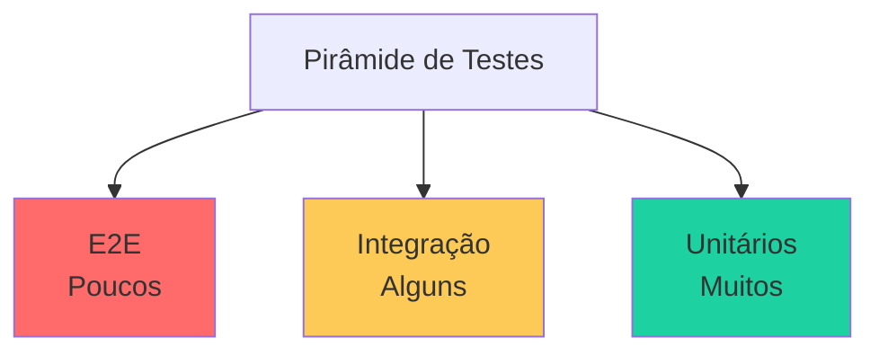

# Testes

## Introdução

Esta documentação descreve a estratégia de testes para o TireWatch Pro. Embora o projeto atual não tenha uma suíte de testes completa implementada, este documento serve como guia para implementação futura.

### Por que testar?

- **Confiança**: Garantir que o código funciona como esperado
- **Prevenção**: Evitar regressões (quebrar algo que funcionava)
- **Documentação**: Testes servem como documentação viva do comportamento esperado
- **Refatoração**: Permite melhorar o código com segurança

## Tipos de Testes



### Testes Unitários

Testam unidades isoladas de código (funções, componentes).

**Características:**
- Rápidos de executar
- Fáceis de escrever
- Testam uma coisa por vez
- Não dependem de serviços externos

**Exemplo:**

```typescript
// utils.test.ts
import { formatPressure, isValidEmail } from './utils';

describe('formatPressure', () => {
  it('formata pressão com 1 casa decimal', () => {
    expect(formatPressure(3.14159)).toBe('3.1 bar');
  });

  it('retorna "N/A" para valores nulos', () => {
    expect(formatPressure(null)).toBe('N/A');
  });
});

describe('isValidEmail', () => {
  it('aceita email válido', () => {
    expect(isValidEmail('user@example.com')).toBe(true);
  });

  it('rejeita email inválido', () => {
    expect(isValidEmail('invalid-email')).toBe(false);
  });
});
```

### Testes de Componentes

Testam componentes React isoladamente.

**Exemplo:**

```typescript
// MachineCard.test.tsx
import { render, screen } from '@testing-library/react';
import { MachineCard } from './MachineCard';

const mockMachine = {
  id: '1',
  name: 'Trator 001',
  model: 'John Deere 8R',
  status: 'operational',
};

describe('MachineCard', () => {
  it('renderiza nome da máquina', () => {
    render(<MachineCard machine={mockMachine} />);
    expect(screen.getByText('Trator 001')).toBeInTheDocument();
  });

  it('mostra badge de status correto', () => {
    render(<MachineCard machine={mockMachine} />);
    expect(screen.getByText('Operacional')).toBeInTheDocument();
  });

  it('chama onClick quando clicado', () => {
    const handleClick = jest.fn();
    render(<MachineCard machine={mockMachine} onClick={handleClick} />);
    
    screen.getByRole('article').click();
    expect(handleClick).toHaveBeenCalledTimes(1);
  });
});
```

### Testes de Hooks

Testam custom hooks.

**Exemplo:**

```typescript
// useCounter.test.ts
import { renderHook, act } from '@testing-library/react';
import { useCounter } from './useCounter';

describe('useCounter', () => {
  it('inicia com valor 0', () => {
    const { result } = renderHook(() => useCounter());
    expect(result.current.count).toBe(0);
  });

  it('incrementa o contador', () => {
    const { result } = renderHook(() => useCounter());
    
    act(() => {
      result.current.increment();
    });
    
    expect(result.current.count).toBe(1);
  });
});
```

### Testes de Integração

Testam múltiplos componentes trabalhando juntos.

**Exemplo:**

```typescript
// Dashboard.integration.test.tsx
import { render, screen, waitFor } from '@testing-library/react';
import { QueryClient, QueryClientProvider } from '@tanstack/react-query';
import { Dashboard } from './Dashboard';

// Mock do Supabase
jest.mock('@/integrations/supabase/client', () => ({
  supabase: {
    from: () => ({
      select: () => ({
        data: [{ id: '1', name: 'Trator 001' }],
        error: null,
      }),
    }),
  },
}));

describe('Dashboard Integration', () => {
  it('carrega e exibe máquinas', async () => {
    const queryClient = new QueryClient();
    
    render(
      <QueryClientProvider client={queryClient}>
        <Dashboard />
      </QueryClientProvider>
    );
    
    await waitFor(() => {
      expect(screen.getByText('Trator 001')).toBeInTheDocument();
    });
  });
});
```

### Testes E2E (End-to-End)

Testam fluxos completos do usuário.

**Exemplo com Playwright:**

```typescript
// login.e2e.test.ts
import { test, expect } from '@playwright/test';

test('usuário consegue fazer login', async ({ page }) => {
  // Acessa página de login
  await page.goto('/auth');
  
  // Preenche formulário
  await page.fill('input[name="email"]', 'test@example.com');
  await page.fill('input[name="password"]', 'password123');
  
  // Clica no botão de login
  await page.click('button[type="submit"]');
  
  // Verifica redirecionamento para dashboard
  await expect(page).toHaveURL('/dashboard');
  await expect(page.locator('h1')).toContainText('Dashboard');
});
```

## Ferramentas Recomendadas

| Ferramenta | Propósito |
|------------|-----------|
| **Vitest** | Test runner (alternativa ao Jest, mais rápido com Vite) |
| **React Testing Library** | Testes de componentes React |
| **Playwright** | Testes E2E |
| **MSW** | Mock de APIs |

## Estrutura de Arquivos

```
src/
├── components/
│   └── dashboard/
│       ├── MachineCard.tsx
│       └── MachineCard.test.tsx    # Teste junto do componente
├── hooks/
│   └── useMachines.ts
│   └── useMachines.test.ts
└── utils/
    └── formatters.ts
    └── formatters.test.ts

tests/
├── e2e/                            # Testes E2E
│   ├── login.e2e.test.ts
│   └── dashboard.e2e.test.ts
└── integration/                    # Testes de integração
    └── dashboard.integration.test.ts
```

## Configuração (Vitest)

```typescript
// vitest.config.ts
import { defineConfig } from 'vitest/config';
import react from '@vitejs/plugin-react';
import path from 'path';

export default defineConfig({
  plugins: [react()],
  test: {
    environment: 'jsdom',
    globals: true,
    setupFiles: ['./src/test/setup.ts'],
  },
  resolve: {
    alias: {
      '@': path.resolve(__dirname, './src'),
    },
  },
});
```

```typescript
// src/test/setup.ts
import '@testing-library/jest-dom';
```

## Scripts

```json
{
  "scripts": {
    "test": "vitest",
    "test:ui": "vitest --ui",
    "test:coverage": "vitest --coverage",
    "test:e2e": "playwright test"
  }
}
```

## Boas Práticas

### O que testar

✅ Lógica de negócio (funções utilitárias)  
✅ Componentes críticos (formulários, modais)  
✅ Custom hooks  
✅ Fluxos principais do usuário (E2E)  

### O que NÃO testar

❌ Bibliotecas de terceiros (já são testadas)  
❌ Estilos CSS  
❌ Código gerado automaticamente  

### Princípios

1. **Teste comportamento, não implementação**
2. **Um teste, uma asserção principal**
3. **Testes devem ser independentes**
4. **Use nomes descritivos**

## Próximos Passos

- [Guia de Desenvolvimento](13-GUIA-DESENVOLVIMENTO.md) - Como executar testes
- [Boas Práticas](14-BOAS-PRATICAS.md) - Convenções de código
