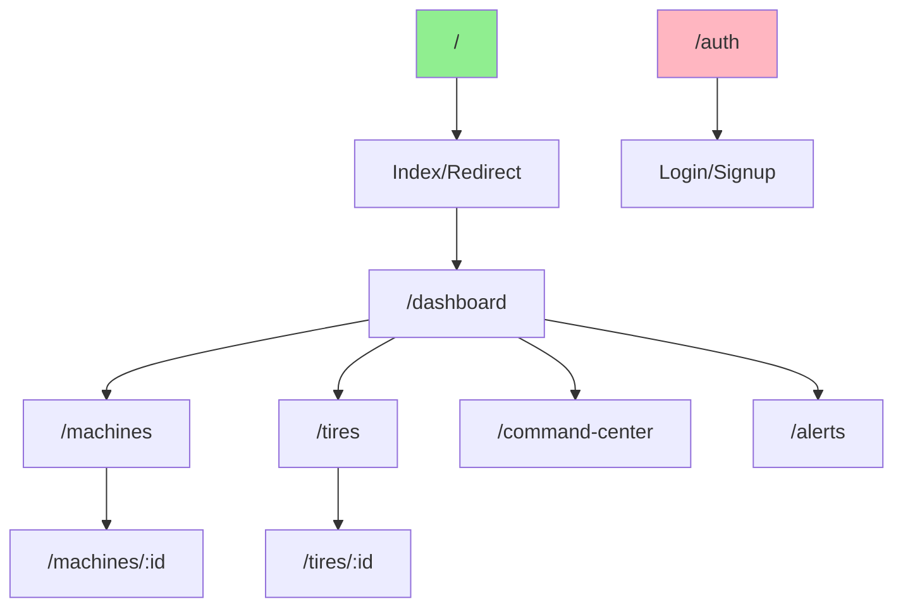

# Frontend React

## Introdução

O frontend do TireWatch Pro é uma **Single Page Application (SPA)** construída com React. Isso significa que toda a aplicação roda em uma única página HTML, e a navegação entre telas acontece sem recarregar a página - tornando a experiência mais rápida e fluida.

### O que é React?

React é uma biblioteca JavaScript criada pelo Facebook para construir interfaces de usuário. A ideia principal é dividir a interface em "componentes" reutilizáveis - como peças de LEGO que você combina para construir algo maior.

## Estrutura de Diretórios

```
src/
├── 🚀 main.tsx              # Ponto de entrada da aplicação
├── 🎨 App.tsx               # Componente raiz com rotas
├── 🎨 App.css               # Estilos do App
├── 🎨 index.css             # Estilos globais (Tailwind)
│
├── 📁 components/           # Componentes React (~200)
│   ├── analytics/           # Gráficos e métricas
│   ├── auth/                # Autenticação
│   ├── command-center/      # Centro de comando
│   ├── dashboard/           # Dashboard principal
│   ├── layout/              # Layout e navegação
│   ├── ui/                  # Componentes base (shadcn/ui)
│   └── ...                  # Outros módulos
│
├── 📁 contexts/             # Estado global
│   ├── AuthContext.tsx      # Autenticação
│   ├── TenantContext.tsx    # Multi-tenancy
│   └── DashboardContext.tsx # Dados do dashboard
│
├── 📁 hooks/                # Custom hooks (28)
│   ├── useRealtimeAlerts.ts
│   ├── useLiveTelemetry.ts
│   └── ...
│
├── 📁 pages/                # Páginas/Routes (36)
│   ├── Dashboard.tsx
│   ├── MachinesPage.tsx
│   └── ...
│
├── 📁 integrations/         # Integrações externas
│   └── supabase/
│       ├── client.ts        # Cliente Supabase
│       └── types.ts         # Tipos gerados
│
├── 📁 lib/                  # Utilitários
│   └── utils.ts             # Funções auxiliares
│
└── 📁 types/                # Definições TypeScript
    └── index.ts             # Tipos principais
```

## Entry Point (Ponto de Entrada)

### main.tsx

Este é o primeiro arquivo que executa quando a aplicação inicia:

```typescript
import React from 'react';
import ReactDOM from 'react-dom/client';
import App from './App';
import './index.css';

// Monta a aplicação React no elemento #root do HTML
ReactDOM.createRoot(document.getElementById('root')!).render(
  <React.StrictMode>
    <App />
  </React.StrictMode>
);
```

**Explicando:**
1. Importa React e ReactDOM
2. Importa o componente principal `App`
3. Importa estilos globais
4. "Monta" a aplicação no elemento HTML com id="root"

### App.tsx

O componente raiz que configura toda a aplicação:

```typescript
function App() {
  return (
    <QueryClientProvider client={queryClient}>
      <TooltipProvider>
        <Toaster />
        <BrowserRouter>
          <AuthProvider>
            <Routes>
              {/* Rota pública */}
              <Route path="/auth" element={<AuthPage />} />
              
              {/* Rotas protegidas */}
              <Route element={<ProtectedRoute />}>
                <Route path="/" element={<Index />} />
                <Route path="/dashboard" element={<Dashboard />} />
                <Route path="/machines" element={<MachinesPage />} />
                {/* ... outras rotas */}
              </Route>
            </Routes>
          </AuthProvider>
        </BrowserRouter>
      </TooltipProvider>
    </QueryClientProvider>
  );
}
```

**Explicando a hierarquia:**
1. **QueryClientProvider**: Configura o React Query (cache de dados)
2. **TooltipProvider**: Habilita tooltips em toda a aplicação
3. **Toaster**: Componente para mostrar notificações
4. **BrowserRouter**: Habilita navegação entre páginas
5. **AuthProvider**: Gerencia autenticação
6. **Routes**: Define as rotas da aplicação

## Contexts (Estado Global)

### O que são Contexts?

Contexts são uma forma de compartilhar dados entre componentes sem precisar passar props manualmente em cada nível. Pense como uma "variável global" que qualquer componente pode acessar.

### AuthContext

Gerencia tudo relacionado à autenticação:

```typescript
// O que o AuthContext fornece:
interface AuthContextType {
  user: User | null;           // Dados do usuário logado
  session: Session | null;     // Sessão atual
  loading: boolean;            // Se está carregando
  signIn: (email, password) => Promise<void>;   // Função de login
  signUp: (email, password, name) => Promise<void>; // Função de cadastro
  signOut: () => Promise<void>; // Função de logout
}

// Como usar em qualquer componente:
function MeuComponente() {
  const { user, signOut } = useAuth();
  
  return (
    <div>
      <p>Olá, {user?.name}!</p>
      <button onClick={signOut}>Sair</button>
    </div>
  );
}
```

### TenantContext

Gerencia multi-tenancy (múltiplas unidades):

```typescript
// O que o TenantContext fornece:
interface TenantContextType {
  units: Unit[];                    // Lista de unidades do usuário
  selectedUnitId: string | null;    // Unidade selecionada
  selectUnit: (id: string) => void; // Função para trocar unidade
}

// Como usar:
function SeletorUnidade() {
  const { units, selectedUnitId, selectUnit } = useTenant();
  
  return (
    <select 
      value={selectedUnitId} 
      onChange={(e) => selectUnit(e.target.value)}
    >
      {units.map(unit => (
        <option key={unit.id} value={unit.id}>{unit.name}</option>
      ))}
    </select>
  );
}
```

### DashboardContext

Centraliza dados do dashboard para evitar múltiplas requisições:

```typescript
// O que o DashboardContext fornece:
interface DashboardContextType {
  machines: Machine[];           // Lista de máquinas
  alerts: Alert[];               // Lista de alertas
  stats: DashboardStats;         // Estatísticas
  isLoading: boolean;            // Se está carregando
  refetch: () => void;           // Função para recarregar
}
```

## Custom Hooks

### O que são Hooks?

Hooks são funções especiais do React que permitem "conectar" seu componente a funcionalidades como estado, efeitos colaterais, contextos, etc.

### Hooks Principais do Projeto

#### useRealtimeAlerts

Escuta novos alertas em tempo real:

```typescript
function useRealtimeAlerts() {
  const queryClient = useQueryClient();

  useEffect(() => {
    // Cria canal de comunicação com Supabase
    const channel = supabase
      .channel('alerts-realtime')
      .on(
        'postgres_changes',
        { event: '*', schema: 'public', table: 'alerts' },
        (payload) => {
          // Quando algo muda na tabela alerts...
          queryClient.invalidateQueries({ queryKey: ['alerts'] });
          
          // Se for um novo alerta, mostra notificação
          if (payload.eventType === 'INSERT') {
            toast.warning('Novo alerta recebido!');
          }
        }
      )
      .subscribe();

    // Limpa quando componente é desmontado
    return () => {
      supabase.removeChannel(channel);
    };
  }, [queryClient]);
}
```

#### useLiveTelemetry

Recebe dados de telemetria em tempo real:

```typescript
function useLiveTelemetry(machineId: string) {
  const [telemetry, setTelemetry] = useState<TelemetryData | null>(null);

  useEffect(() => {
    const channel = supabase
      .channel(`telemetry-${machineId}`)
      .on(
        'postgres_changes',
        { 
          event: 'INSERT', 
          schema: 'public', 
          table: 'telemetry',
          filter: `machine_id=eq.${machineId}`
        },
        (payload) => {
          setTelemetry(payload.new as TelemetryData);
        }
      )
      .subscribe();

    return () => supabase.removeChannel(channel);
  }, [machineId]);

  return telemetry;
}
```

#### useAIInsights

Busca insights gerados por IA:

```typescript
function useAIInsights(fleetData: FleetData) {
  return useQuery({
    queryKey: ['ai-insights', fleetData],
    queryFn: async () => {
      const response = await supabase.functions.invoke('ai-insights', {
        body: { type: 'insights', fleetData }
      });
      return response.data;
    },
    staleTime: 5 * 60 * 1000, // 5 minutos
  });
}
```

## Roteamento

### Como funciona a navegação?

Usamos **React Router DOM** para gerenciar a navegação entre páginas.



### Rotas Protegidas

Rotas que requerem autenticação são envolvidas pelo `ProtectedRoute`:

```typescript
// ProtectedRoute verifica se usuário está logado
function ProtectedRoute() {
  const { user, loading } = useAuth();
  
  // Ainda carregando? Mostra spinner
  if (loading) {
    return <LoadingSpinner />;
  }
  
  // Não logado? Redireciona para login
  if (!user) {
    return <Navigate to="/auth" replace />;
  }
  
  // Logado? Renderiza a página
  return <Outlet />;
}
```

### Lista de Rotas

| Rota | Página | Descrição |
|------|--------|-----------|
| `/auth` | AuthPage | Login e cadastro |
| `/` | Index | Redireciona para dashboard |
| `/dashboard` | Dashboard | Painel principal |
| `/machines` | MachinesPage | Lista de máquinas |
| `/machines/:id` | MachineDetailPage | Detalhes de uma máquina |
| `/tires` | TiresPage | Lista de pneus |
| `/tires/:id` | TireDetailPage | Detalhes de um pneu |
| `/command-center` | CommandCenterPage | Centro de comando |
| `/alerts` | AlertsPage | Lista de alertas |
| `/geolocation` | GeolocationPage | Mapa da frota |
| `/analytics` | AdvancedAnalyticsPage | Analytics avançados |
| `/bi` | BusinessIntelligencePage | Business Intelligence |
| `/occurrences` | OccurrencesPage | Ocorrências |
| `/profile` | ProfilePage | Perfil do usuário |

## Gerenciamento de Estado

### React Query (TanStack Query)

Usamos React Query para gerenciar dados do servidor:

```typescript
// Buscar dados
const { data, isLoading, error } = useQuery({
  queryKey: ['machines'],
  queryFn: async () => {
    const { data } = await supabase.from('machines').select('*');
    return data;
  }
});

// Modificar dados
const mutation = useMutation({
  mutationFn: async (newMachine) => {
    const { data } = await supabase.from('machines').insert(newMachine);
    return data;
  },
  onSuccess: () => {
    // Atualiza a lista após inserir
    queryClient.invalidateQueries({ queryKey: ['machines'] });
  }
});
```

**Benefícios do React Query:**
- Cache automático de dados
- Revalidação em background
- Deduplicação de requisições
- Estados de loading/error automáticos
- Retry automático em caso de erro

### Estado Local vs Global

| Tipo | Quando usar | Exemplo |
|------|-------------|---------|
| **useState** | Estado local de um componente | Formulário aberto/fechado |
| **Context** | Estado compartilhado entre muitos componentes | Usuário logado |
| **React Query** | Dados do servidor | Lista de máquinas |

## Estilização

### Tailwind CSS

Usamos Tailwind CSS para estilização - uma abordagem "utility-first":

```tsx
// Ao invés de criar classes CSS separadas...
<div className="flex items-center justify-between p-4 bg-white rounded-lg shadow">
  <span className="text-lg font-semibold text-gray-900">Título</span>
  <button className="px-4 py-2 bg-blue-500 text-white rounded hover:bg-blue-600">
    Ação
  </button>
</div>
```

**Classes comuns:**
| Classe | O que faz |
|--------|-----------|
| `flex` | Display flex |
| `items-center` | Alinha itens no centro (vertical) |
| `justify-between` | Espaço entre itens |
| `p-4` | Padding de 1rem |
| `bg-white` | Fundo branco |
| `rounded-lg` | Bordas arredondadas |
| `shadow` | Sombra |
| `text-lg` | Texto grande |
| `font-semibold` | Fonte semi-negrito |

### shadcn/ui

Usamos shadcn/ui como base de componentes:

```tsx
import { Button } from '@/components/ui/button';
import { Card, CardHeader, CardTitle, CardContent } from '@/components/ui/card';
import { Input } from '@/components/ui/input';

function MeuFormulario() {
  return (
    <Card>
      <CardHeader>
        <CardTitle>Novo Alerta</CardTitle>
      </CardHeader>
      <CardContent>
        <Input placeholder="Descrição" />
        <Button>Salvar</Button>
      </CardContent>
    </Card>
  );
}
```

## TypeScript

### Por que TypeScript?

TypeScript adiciona "tipos" ao JavaScript, ajudando a evitar erros:

```typescript
// Sem TypeScript - pode dar erro em runtime
function somar(a, b) {
  return a + b;
}
somar("1", 2); // Retorna "12" (concatenação) - provavelmente não era isso que você queria

// Com TypeScript - erro em tempo de desenvolvimento
function somar(a: number, b: number): number {
  return a + b;
}
somar("1", 2); // ❌ Erro: Argument of type 'string' is not assignable to parameter of type 'number'
```

### Tipos Principais do Projeto

```typescript
// src/types/index.ts

export type UserRole = 'admin' | 'manager' | 'technician' | 'operator';

export type MachineStatus = 'operational' | 'warning' | 'critical' | 'offline';

export type AlertSeverity = 'low' | 'medium' | 'high' | 'critical';

export type AlertStatus = 'open' | 'acknowledged' | 'in_progress' | 'resolved';

export interface Machine {
  id: string;
  name: string;
  model: string;
  unit_id: string;
  status: MachineStatus;
  latitude?: number;
  longitude?: number;
}

export interface Alert {
  id: string;
  machine_id: string;
  type: string;
  severity: AlertSeverity;
  status: AlertStatus;
  message: string;
  opened_at: string;
}
```

## Próximos Passos

- [Componentes](04-COMPONENTES.md) - Inventário detalhado de todos os componentes
- [Supabase](05-SUPABASE.md) - Como o frontend se comunica com o backend
- [Boas Práticas](14-BOAS-PRATICAS.md) - Convenções de código
