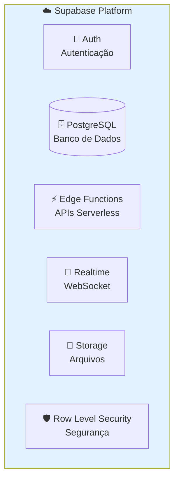

# Supabase (Backend)

## Introdução

O **Supabase** é uma plataforma de Backend-as-a-Service (BaaS) que fornece toda a infraestrutura de backend que o TireWatch Pro precisa. Pense nele como um "backend pronto" - ao invés de construir um servidor do zero, usamos os serviços do Supabase.

### O que o Supabase oferece?



| Serviço | O que faz | Exemplo de uso |
|---------|-----------|----------------|
| **Auth** | Gerencia login, cadastro, sessões | Login com email/senha |
| **Database** | Banco de dados PostgreSQL | Armazenar máquinas, alertas |
| **Edge Functions** | Código serverless (Deno) | API de telemetria |
| **Realtime** | Atualizações em tempo real | Novos alertas aparecem instantaneamente |
| **Storage** | Armazenamento de arquivos | Fotos de ocorrências |
| **RLS** | Segurança por linha | Usuário só vê suas unidades |

## Configuração do Cliente

### Inicialização

O cliente Supabase é configurado em `src/integrations/supabase/client.ts`:

```typescript
import { createClient } from '@supabase/supabase-js';

const supabaseUrl = import.meta.env.VITE_SUPABASE_URL;
const supabaseKey = import.meta.env.VITE_SUPABASE_PUBLISHABLE_KEY;

export const supabase = createClient(supabaseUrl, supabaseKey);
```

### Variáveis de Ambiente

```env
VITE_SUPABASE_URL=https://mwvtdxdzvxzmswpkeoko.supabase.co
VITE_SUPABASE_PUBLISHABLE_KEY=eyJ...
```

## Autenticação (Auth)

### Login

```typescript
const { data, error } = await supabase.auth.signInWithPassword({
  email: 'usuario@empresa.com',
  password: 'senha123'
});

if (error) {
  console.error('Erro no login:', error.message);
} else {
  console.log('Usuário logado:', data.user);
}
```

### Cadastro

```typescript
const { data, error } = await supabase.auth.signUp({
  email: 'novo@empresa.com',
  password: 'senha123',
  options: {
    data: {
      name: 'Nome do Usuário'
    }
  }
});
```

### Logout

```typescript
await supabase.auth.signOut();
```

### Verificar Sessão

```typescript
const { data: { session } } = await supabase.auth.getSession();

if (session) {
  console.log('Usuário logado:', session.user);
} else {
  console.log('Não autenticado');
}
```

## Banco de Dados (PostgreSQL)

### Queries Básicas

#### SELECT (Buscar dados)

```typescript
// Buscar todas as máquinas
const { data, error } = await supabase
  .from('machines')
  .select('*');

// Buscar com filtro
const { data, error } = await supabase
  .from('machines')
  .select('*')
  .eq('unit_id', selectedUnitId)
  .eq('status', 'operational');

// Buscar com relacionamentos
const { data, error } = await supabase
  .from('machines')
  .select(`
    *,
    tires (*),
    alerts (*)
  `)
  .eq('unit_id', selectedUnitId);
```

#### INSERT (Inserir dados)

```typescript
const { data, error } = await supabase
  .from('occurrences')
  .insert({
    machine_id: machineId,
    description: 'Pneu furado',
    created_by: userId
  })
  .select()
  .single();
```

#### UPDATE (Atualizar dados)

```typescript
const { error } = await supabase
  .from('alerts')
  .update({ status: 'resolved' })
  .eq('id', alertId);
```

#### DELETE (Excluir dados)

```typescript
const { error } = await supabase
  .from('tires')
  .delete()
  .eq('id', tireId);
```

### Filtros Avançados

```typescript
// Múltiplos filtros
const { data } = await supabase
  .from('alerts')
  .select('*')
  .eq('status', 'open')
  .in('severity', ['high', 'critical'])
  .gte('opened_at', '2026-01-01')
  .order('opened_at', { ascending: false })
  .limit(50);

// Busca textual
const { data } = await supabase
  .from('machines')
  .select('*')
  .ilike('name', '%trator%');
```

## Realtime (Tempo Real)

### O que é Realtime?

Realtime permite que a aplicação receba atualizações instantaneamente quando dados mudam no banco. Usa WebSocket para manter uma conexão aberta.

### Subscription (Escutar mudanças)

```typescript
// Escutar mudanças na tabela alerts
const channel = supabase
  .channel('alerts-changes')
  .on(
    'postgres_changes',
    {
      event: '*',        // INSERT, UPDATE, DELETE ou *
      schema: 'public',
      table: 'alerts'
    },
    (payload) => {
      console.log('Mudança detectada:', payload);
      
      if (payload.eventType === 'INSERT') {
        console.log('Novo alerta:', payload.new);
      } else if (payload.eventType === 'UPDATE') {
        console.log('Alerta atualizado:', payload.new);
      } else if (payload.eventType === 'DELETE') {
        console.log('Alerta deletado:', payload.old);
      }
    }
  )
  .subscribe();

// Cancelar subscription
supabase.removeChannel(channel);
```

### Filtrar por coluna

```typescript
// Só escutar alertas de uma máquina específica
const channel = supabase
  .channel('machine-alerts')
  .on(
    'postgres_changes',
    {
      event: 'INSERT',
      schema: 'public',
      table: 'alerts',
      filter: `machine_id=eq.${machineId}`
    },
    (payload) => {
      console.log('Novo alerta para esta máquina:', payload.new);
    }
  )
  .subscribe();
```

## Edge Functions

### O que são Edge Functions?

Edge Functions são código que roda no servidor do Supabase (não no navegador). São úteis para:
- Lógica que precisa de segurança (não pode rodar no navegador)
- Integrações com serviços externos
- Processamento pesado

### Invocar uma Edge Function

```typescript
// Chamar a função de telemetria
const { data, error } = await supabase.functions.invoke('telemetry-ingest', {
  body: {
    machineId: '123',
    pressure: 3.2,
    speed: 25
  }
});

// Chamar a função de IA
const { data, error } = await supabase.functions.invoke('ai-insights', {
  body: {
    type: 'insights',
    fleetData: {
      totalMachines: 50,
      activeAlerts: 10
    }
  }
});
```

### Edge Functions do Projeto

| Função | Método | Descrição |
|--------|--------|-----------|
| `alerts` | GET | Lista alertas com filtros |
| `telemetry-ingest` | POST | Recebe dados dos sensores |
| `ai-insights` | POST | Gera insights com IA |
| `occurrences` | GET/POST | CRUD de ocorrências |
| `alert-actions` | POST | Ações em alertas |
| `machine-timeline` | GET | Timeline de uma máquina |

## Row Level Security (RLS)

### O que é RLS?

RLS (Row Level Security) é uma funcionalidade do PostgreSQL que controla quem pode ver/editar cada linha do banco. É como um "filtro automático" que garante que usuários só acessem dados permitidos.

### Como funciona?

```sql
-- Política: Usuário só vê máquinas das suas unidades
CREATE POLICY "users_view_own_units_machines"
ON machines FOR SELECT
USING (
  unit_id IN (
    SELECT unnest(unit_ids) 
    FROM profiles 
    WHERE user_id = auth.uid()
  )
);
```

**Explicando:**
1. Quando alguém faz `SELECT * FROM machines`
2. O PostgreSQL verifica a política
3. Só retorna máquinas onde `unit_id` está na lista de unidades do usuário

### Benefícios

- **Segurança**: Impossível acessar dados de outras unidades
- **Simplicidade**: Não precisa filtrar no código
- **Performance**: Filtro acontece no banco de dados

## Storage (Arquivos)

### Upload de arquivo

```typescript
const file = event.target.files[0];

const { data, error } = await supabase.storage
  .from('occurrences')
  .upload(`${occurrenceId}/${file.name}`, file);
```

### Download de arquivo

```typescript
const { data } = supabase.storage
  .from('occurrences')
  .getPublicUrl(`${occurrenceId}/foto.jpg`);

console.log('URL pública:', data.publicUrl);
```

## Integração com React Query

### Query (Buscar dados)

```typescript
function useMachines() {
  return useQuery({
    queryKey: ['machines'],
    queryFn: async () => {
      const { data, error } = await supabase
        .from('machines')
        .select('*')
        .order('name');
      
      if (error) throw error;
      return data;
    }
  });
}

// Uso no componente
function MachinesList() {
  const { data: machines, isLoading, error } = useMachines();
  
  if (isLoading) return <Spinner />;
  if (error) return <Error message={error.message} />;
  
  return machines.map(m => <MachineCard key={m.id} machine={m} />);
}
```

### Mutation (Modificar dados)

```typescript
function useResolveAlert() {
  const queryClient = useQueryClient();
  
  return useMutation({
    mutationFn: async (alertId: string) => {
      const { error } = await supabase
        .from('alerts')
        .update({ status: 'resolved' })
        .eq('id', alertId);
      
      if (error) throw error;
    },
    onSuccess: () => {
      // Atualiza a lista de alertas
      queryClient.invalidateQueries({ queryKey: ['alerts'] });
      toast.success('Alerta resolvido!');
    },
    onError: (error) => {
      toast.error(`Erro: ${error.message}`);
    }
  });
}
```

## Próximos Passos

- [API](06-API.md) - Detalhes das Edge Functions
- [Autenticação](07-AUTENTICACAO.md) - Sistema de auth completo
- [Banco de Dados](08-BANCO-DE-DADOS.md) - Schema detalhado
