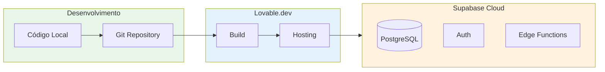

# Deploy e CI/CD

## Introdução

O TireWatch Pro é hospedado na plataforma **Lovable.dev**, que oferece deploy automático e hospedagem integrada. O backend (Supabase) é gerenciado separadamente na nuvem do Supabase.

## Arquitetura de Deploy



## Ambientes

| Ambiente | URL | Descrição |
|----------|-----|-----------|
| **Desenvolvimento** | localhost:8080 | Máquina local |
| **Produção** | (URL Lovable) | Ambiente de produção |

## Deploy no Lovable.dev

### Processo Automático

1. **Push para repositório** - Código é enviado para o Git
2. **Build automático** - Lovable detecta mudanças e inicia build
3. **Deploy** - Nova versão é publicada automaticamente

### Build de Produção

```bash
# Comando executado pelo Lovable
npm run build
```

Isso gera a pasta `dist/` com arquivos otimizados:
- JavaScript minificado
- CSS otimizado
- Assets comprimidos
- Code splitting automático

## Supabase

### Edge Functions

As Edge Functions são deployadas separadamente:

```bash
# Deploy de todas as funções
supabase functions deploy

# Deploy de função específica
supabase functions deploy telemetry-ingest
```

### Migrations

Migrations são aplicadas ao banco de produção:

```bash
# Aplicar migrations
supabase db push
```

## Variáveis de Ambiente

### Desenvolvimento (.env.local)

```env
VITE_SUPABASE_URL=https://xxx.supabase.co
VITE_SUPABASE_PUBLISHABLE_KEY=eyJ...
```

### Produção

Configuradas no painel do Lovable.dev ou Supabase Dashboard.

## Checklist de Deploy

### Antes do Deploy

- [ ] Código testado localmente
- [ ] Build passa sem erros (`npm run build`)
- [ ] Lint passa (`npm run lint`)
- [ ] Variáveis de ambiente configuradas
- [ ] Migrations aplicadas no banco de produção

### Após o Deploy

- [ ] Verificar se aplicação carrega
- [ ] Testar login
- [ ] Verificar funcionalidades principais
- [ ] Monitorar logs de erro

## Rollback

Se algo der errado após o deploy:

1. **Lovable.dev**: Reverter para versão anterior no painel
2. **Supabase**: Restaurar backup do banco se necessário

## Monitoramento

### Logs da Aplicação

- Console do navegador (DevTools)
- Logs do Lovable.dev

### Logs do Supabase

- Dashboard do Supabase > Logs
- Edge Functions logs

### Health Checks

```bash
# Verificar se API está respondendo
curl https://xxx.supabase.co/functions/v1/alerts
```

## Próximos Passos

- [Configuração](11-CONFIGURACAO.md) - Variáveis de ambiente detalhadas
- [Troubleshooting](15-TROUBLESHOOTING.md) - Problemas de deploy
