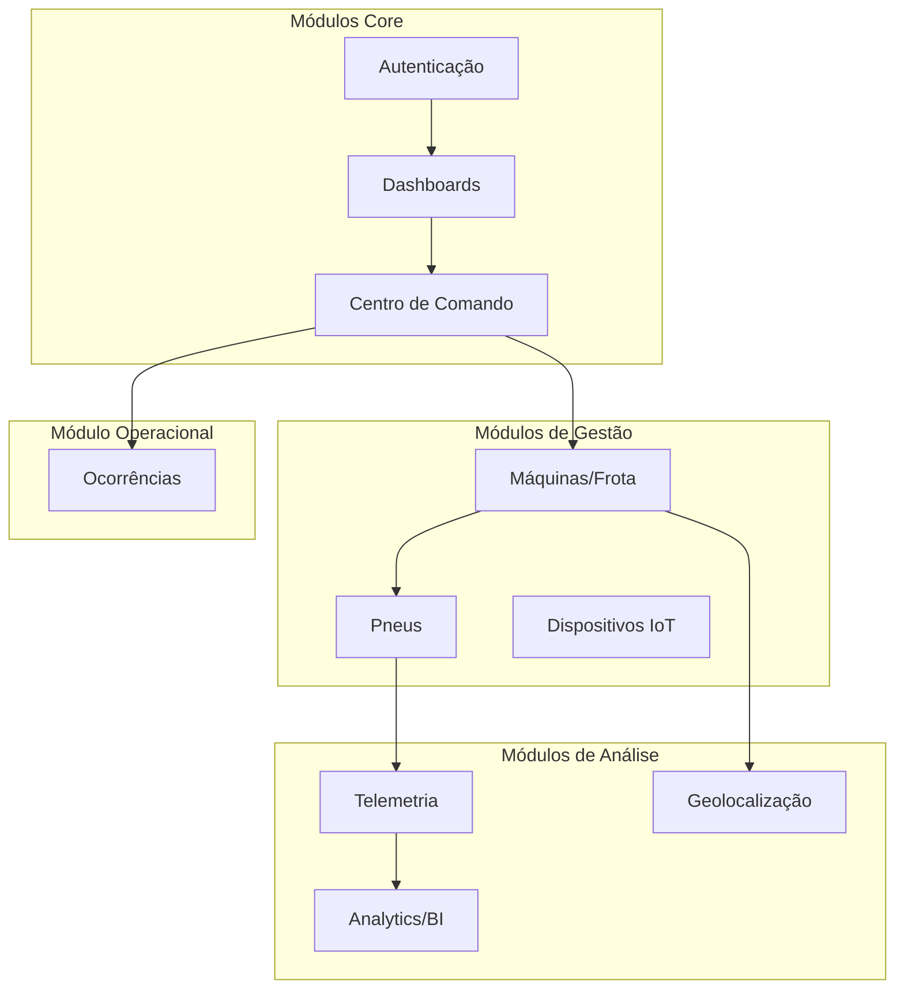
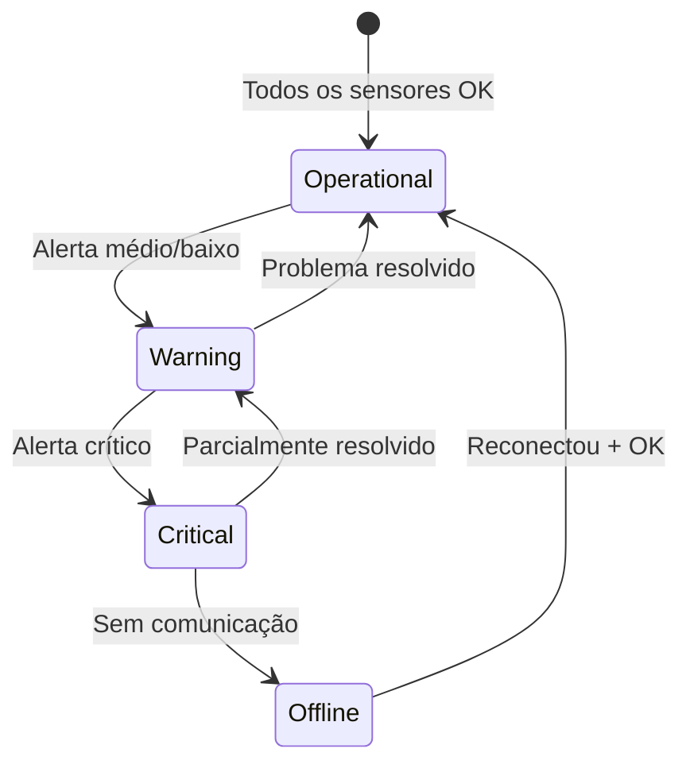

# Especificação do Produto: TireWatch Pro

## Sistema de Monitoramento Inteligente de Pneus para Frotas Agrícolas e Industriais

---

## 1. Visão Geral do Produto

### 1.1 Propósito

O **TireWatch Pro** é uma plataforma SaaS completa para monitoramento em tempo real de pneus em frotas de máquinas agrícolas e industriais. O sistema coleta dados de sensores IoT, processa telemetria, gera alertas automáticos e fornece insights através de inteligência artificial.

### 1.2 Proposta de Valor

- **Redução de custos** com manutenção preventiva baseada em dados
- **Aumento de produtividade** evitando paradas não planejadas
- **Segurança operacional** com alertas em tempo real
- **Tomada de decisão** baseada em dados e IA

### 1.3 Público-Alvo

| Perfil | Descrição | Necessidades |
|--------|-----------|--------------|
| **Gestor de Frota** | Responsável pela operação de múltiplas máquinas | Visão geral, relatórios, custos |
| **Técnico de Manutenção** | Realiza calibrações e manutenções | Alertas, histórico, procedimentos |
| **Operador de Campo** | Opera as máquinas diariamente | Alertas móveis, registro de ocorrências |
| **Administrador** | Gerencia usuários e configurações | Controle total, multi-tenant |

---

## 2. Premissas e Restrições

### 2.1 Premissas

| Premissa | Descrição |
|----------|-----------|
| **Conectividade** | Sensores IoT com conectividade para envio de dados |
| **Dados Principais** | Pressão (bar), Velocidade (km/h), Temperatura (°C) |
| **Multi-Plataforma** | Web responsiva + suporte mobile (PWA) |
| **Multi-Tenant** | Isolamento de dados por organização/unidade |
| **Tempo Real** | Atualizações via WebSocket em menos de 5 segundos |

### 2.2 Restrições Técnicas

| Restrição | Especificação |
|-----------|---------------|
| **Backend** | Supabase (PostgreSQL + Edge Functions) |
| **Frontend** | React 18 + TypeScript + Vite |
| **UI Framework** | Tailwind CSS + shadcn/ui |
| **Mapas** | Mapbox GL |
| **IA** | Google Gemini 2.5 Flash |

---

## 3. Arquitetura de Módulos

O sistema é organizado em **10 módulos funcionais**:



---

## 4. Requisitos Funcionais Detalhados

### RF01 - Módulo de Autenticação e Multi-Tenant

**Descrição:** Sistema de autenticação seguro com suporte a múltiplas organizações e unidades operacionais.

**Funcionalidades:**

| ID | Funcionalidade | Prioridade |
|----|----------------|------------|
| RF01.1 | Login com email e senha | Alta |
| RF01.2 | Recuperação de senha | Alta |
| RF01.3 | Seleção de unidade (tenant) | Alta |
| RF01.4 | Gestão de perfis (Admin, Manager, Technician, Operator) | Alta |
| RF01.5 | Row Level Security por organização/unidade | Alta |
| RF01.6 | Sessões com JWT e refresh token | Alta |

**Rotas Implementadas:**
- `/auth` - Página de autenticação

**Componentes:**
- `auth/ProtectedRoute.tsx` - Proteção de rotas
- `AuthContext.tsx` - Contexto de autenticação
- `TenantContext.tsx` - Contexto multi-tenant

**Critérios de Aceitação:**
- [ ] Usuário consegue fazer login com credenciais válidas
- [ ] Sistema redireciona para seleção de unidade após login
- [ ] Dados são isolados por organização (RLS)
- [ ] Token expira e renova automaticamente

---

### RF02 - Módulo de Dashboards

**Descrição:** Visões consolidadas de informações da frota em diferentes níveis de detalhe.

**Funcionalidades:**

| ID | Funcionalidade | Descrição |
|----|----------------|-----------|
| RF02.1 | **Dashboard Principal** | Visão executiva com KPIs, alertas e tendências |
| RF02.2 | **Dashboard Operacional** | Visão operacional em tempo real |
| RF02.3 | **Dashboard de Balanceamento** | Análise de balanceamento de pneus |

**Rotas Implementadas:**
- `/` - Dashboard Principal
- `/operations` - Dashboard Operacional
- `/balance` - Dashboard de Balanceamento

**Componentes Principais:**
```
components/dashboard/
├── AlertsOverviewCard.tsx      # Resumo de alertas
├── DashboardMetrics.tsx        # Métricas principais
├── FleetHealthCard.tsx         # Saúde da frota
├── FleetHealthScore.tsx        # Score de saúde
├── MachineStatusCards.tsx      # Status das máquinas
├── MetricsGrid.tsx             # Grid de métricas
├── PressureChart.tsx           # Gráfico de pressão
├── RecentOccurrences.tsx       # Ocorrências recentes
├── TrendChart.tsx              # Gráficos de tendência
└── ... (28 componentes)
```

**KPIs Exibidos:**
| KPI | Descrição | Cálculo |
|-----|-----------|---------|
| Fleet Health Score | Saúde geral da frota | 0-100 baseado em alertas |
| Alertas Ativos | Problemas pendentes | Contagem por severidade |
| Máquinas Operacionais | Status da frota | % operando normalmente |
| Pressão Média | Média de pressão | Média de todos os pneus |

**Critérios de Aceitação:**
- [ ] Dashboard carrega em menos de 3 segundos
- [ ] Dados atualizam em tempo real via WebSocket
- [ ] Gráficos são interativos (zoom, filtros)
- [ ] Responsivo para tablet e desktop

---

### RF03 - Módulo Centro de Comando (Command Center)

**Descrição:** Central de gerenciamento de alertas com priorização, SLA e colaboração de equipe.

**Funcionalidades:**

| ID | Funcionalidade | Descrição |
|----|----------------|-----------|
| RF03.1 | **Lista de Alertas** | Todos os alertas com filtros avançados |
| RF03.2 | **Sistema de SLA** | Countdown por severidade |
| RF03.3 | **Priorização** | Severidade: crítico, alto, médio, baixo |
| RF03.4 | **Feed ao Vivo** | Atualizações em tempo real |
| RF03.5 | **Resolução de Alertas** | Modal para resolver e documentar |
| RF03.6 | **Presença de Equipe** | Quem está online trabalhando |
| RF03.7 | **Colaboração** | Timeline de ações em cada alerta |

**Rotas Implementadas:**
- `/command-center` - Centro de Comando
- `/alerts` - Redirecionamento para Command Center

**Componentes Principais:**
```
components/command-center/
├── ActiveFiltersChips.tsx      # Filtros ativos
├── ActivityFeed.tsx            # Feed de atividades
├── CommandStats.tsx            # Estatísticas
├── FiltersBottomSheet.tsx      # Filtros mobile
├── LiveActivityFeed.tsx        # Feed em tempo real
├── ResolveAlertModal.tsx       # Modal de resolução
├── SlaCountdown.tsx            # Contador de SLA
├── SlaIndicator.tsx            # Indicador visual de SLA
├── SwipeableAlertCard.tsx      # Card com swipe (mobile)
├── TeamPresence.tsx            # Presença da equipe
└── ... (12 componentes)
```

**Níveis de SLA (conforme implementado):**
| Severidade | Cor | Tempo SLA | Ação Esperada |
|------------|-----|-----------|---------------|
| Crítico | 🔴 | 1 hora | Parar operação, investigar imediatamente |
| Alto | 🟠 | 4 horas | Priorizar manutenção |
| Médio | 🟡 | 8 horas | Agendar verificação (alinhado com ocorrências) |
| Baixo | 🟢 | 24 horas | Monitorar tendência |

*Nota: Ocorrências têm SLA padrão de 8 horas.*

**Critérios de Aceitação:**
- [ ] Alertas aparecem em menos de 30 segundos após criação
- [ ] SLA countdown atualiza em tempo real
- [ ] Filtros aplicam instantaneamente
- [ ] Resolução de alerta registra histórico completo

---

### RF04 - Módulo de Gestão de Máquinas e Frota

**Descrição:** Cadastro, monitoramento e gestão completa das máquinas da frota.

**Funcionalidades:**

| ID | Funcionalidade | Descrição |
|----|----------------|-----------|
| RF04.1 | **Lista de Máquinas** | Todas as máquinas com filtros |
| RF04.2 | **Detalhes da Máquina** | Informações completas + pneus |
| RF04.3 | **Gestão de Frota** | Integração com sistemas externos |
| RF04.4 | **Status em Tempo Real** | Operational, Warning, Critical, Offline |
| RF04.5 | **Telemetria por Máquina** | Dados de sensores |

**Rotas Implementadas:**
- `/machines` - Lista de máquinas
- `/machines/:id` - Detalhes da máquina
- `/fleet` - Gestão de frota

**Componentes Principais:**
```
components/fleet/
├── FleetAlertCard.tsx          # Alertas de frota
├── FleetStatsCard.tsx          # Estatísticas
├── IntegrationConfigModal.tsx  # Configurar integrações
├── IntegrationStatusCard.tsx   # Status de integrações
├── VehicleCard.tsx             # Card de veículo
└── VehicleDetailSheet.tsx      # Detalhes em sheet

components/shared/
├── MachineCard.tsx             # Card de máquina
└── StatusBadge.tsx             # Badge de status
```

**Status das Máquinas:**


**Critérios de Aceitação:**
- [ ] Lista carrega com paginação virtual
- [ ] Filtros por status, unidade, tipo
- [ ] Busca por nome/identificador em menos de 1 segundo
- [ ] Status atualiza automaticamente

---

### RF05 - Módulo de Gestão de Pneus

**Descrição:** Ciclo de vida completo dos pneus, desde cadastro até aposentadoria.

**Funcionalidades:**

| ID | Funcionalidade | Descrição |
|----|----------------|-----------|
| RF05.1 | **Cadastro de Pneus** | Registro com número de série |
| RF05.2 | **Lista de Pneus** | Todos os pneus com filtros |
| RF05.3 | **Detalhes do Pneu** | Informações + histórico |
| RF05.4 | **Histórico de Vida** | Todas as máquinas onde foi usado |
| RF05.5 | **Calibração** | Registro e alertas de calibração |
| RF05.6 | **Análise de Deformação** | Detecção de problemas estruturais |
| RF05.7 | **Análise de Desgaste** | Previsão de vida útil |
| RF05.8 | **Lastro de Fluido** | Monitoramento de lastro |

**Rotas Implementadas:**
- `/tires` - Lista de pneus
- `/tires/new` - Cadastrar novo pneu
- `/tires/:id` - Detalhes do pneu
- `/tires/:id/history` - Histórico completo
- `/calibration` - Gestão de calibração
- `/deformation` - Análise de deformação
- `/wear` - Análise de desgaste
- `/fluid` - Lastro de fluido

**Componentes por Área:**
```
components/calibration/
├── CalibrationAlertCard.tsx
├── CalibrationChart.tsx
├── CalibrationSettingsModal.tsx
├── CalibrationStatsCard.tsx
├── TireCalibrationCard.tsx
└── TireCalibrationDetailSheet.tsx

components/deformation/
├── DeformationAlertCard.tsx
├── DeformationAnalysisChart.tsx
├── DeformationSummaryCard.tsx
└── ... (7 componentes)

components/wear/
├── WearAlertCard.tsx
├── WearCalculationChart.tsx
├── WearSettingsModal.tsx
├── WearSummaryCard.tsx
└── ... (7 componentes)

components/fluid/
├── FluidAlertCard.tsx
├── FluidLevelChart.tsx
├── FluidTemperatureChart.tsx
└── ... (7 componentes)
```

**Ciclo de Vida do Pneu:**
| Status | Descrição | Ações Disponíveis |
|--------|-----------|-------------------|
| **Novo** | Recém cadastrado, não instalado | Instalar em máquina |
| **Em Uso** | Instalado e operando | Monitorar, calibrar |
| **Manutenção** | Removido para reparo | Registrar manutenção |
| **Aposentado** | Fim de vida útil | Arquivar histórico |

**Critérios de Aceitação:**
- [ ] Histórico completo de cada pneu disponível
- [ ] Gráficos de evolução de pressão
- [ ] Alertas de calibração automáticos
- [ ] Previsão de desgaste com IA

---

### RF06 - Módulo de Telemetria e Monitoramento

**Descrição:** Coleta, processamento e visualização de dados de sensores em tempo real.

**Funcionalidades:**

| ID | Funcionalidade | Descrição |
|----|----------------|-----------|
| RF06.1 | **Ingestão de Telemetria** | API para receber dados de sensores |
| RF06.2 | **Análise de Telemetria** | Visualização de dados brutos |
| RF06.3 | **Histórico de Pressão** | Gráficos por período |
| RF06.4 | **Análise de Carga** | Distribuição de peso |
| RF06.5 | **Alertas Automáticos** | Geração baseada em regras |

**Rotas Implementadas:**
- `/telemetry` - Análise de telemetria
- `/pressure-history/:id` - Histórico de pressão
- `/load` - Análise de carga

**Componentes Principais:**
```
components/telemetry/
├── AlertSettingsModal.tsx      # Configurar alertas
├── PredictiveAlertCard.tsx     # Alertas preditivos
└── TelemetryGauge.tsx          # Gauge de telemetria

components/load/
├── LoadAlertCard.tsx
├── LoadDistributionChart.tsx
├── LoadSummaryCard.tsx
└── ... (7 componentes)

components/shared/
├── TelemetryChart.tsx          # Gráfico genérico
└── TelemetrySparkline.tsx      # Sparkline
```

**Regras de Alerta Automático:**

*Nota: O sistema usa PSI como unidade de pressão (padrão agrícola brasileiro).*

| Condição | Tipo | Severidade |
|----------|------|------------|
| Pressão < 22 PSI | Pressão Crítica Baixa | Crítico |
| Pressão > 35 PSI | Pressão Crítica Alta | Crítico |
| Pressão fora de ±10% do target (28 PSI) | Pressão Fora do Ideal | Warning |
| Velocidade > 40 km/h | Velocidade Excedida | Crítico |
| Velocidade > 80% do limite (32 km/h) | Velocidade Alta | Warning |
| Temperatura > 60°C | Superaquecimento | Alto |
| Sem dados > 30 min | Sensor Offline | Médio |

**Thresholds Configuráveis (padrão):**
```typescript
{
  pressureMin: 22,      // PSI - mínimo aceitável
  pressureMax: 35,      // PSI - máximo aceitável
  pressureTarget: 28,   // PSI - ideal
  speedMax: 40,         // km/h - limite de velocidade
}
```

**API de Ingestão:**
```
POST /functions/v1/telemetry-ingest
Content-Type: application/json
Authorization: Bearer <api-key>

{
  "machine_id": "uuid",
  "readings": [
    {
      "tire_position": "front_left",
      "pressure": 3.2,
      "speed": 45,
      "temperature": 35,
      "timestamp": "2026-01-12T10:30:00Z"
    }
  ]
}
```

**Critérios de Aceitação:**
- [ ] API processa até 1000 leituras por requisição
- [ ] Alertas gerados em menos de 60 segundos
- [ ] Gráficos atualizam em tempo real
- [ ] Histórico disponível por 12 meses

---

### RF07 - Módulo de Geolocalização

**Descrição:** Rastreamento e visualização geográfica das máquinas.

**Funcionalidades:**

| ID | Funcionalidade | Descrição |
|----|----------------|-----------|
| RF07.1 | **Mapa Interativo** | Visualização de todas as máquinas |
| RF07.2 | **Filtros no Mapa** | Por status, unidade, tipo |
| RF07.3 | **Detalhes no Mapa** | Popup com info da máquina |
| RF07.4 | **Informações de Terreno** | Tipo de terreno atual |
| RF07.5 | **Performance por Área** | Análise geográfica |

**Rotas Implementadas:**
- `/geolocation` - Mapa de geolocalização

**Componentes Principais:**
```
components/geolocation/
├── GeoAlertCard.tsx            # Alertas geográficos
├── GeoLocationDetailSheet.tsx  # Detalhes de localização
├── GeoPerformanceMap.tsx       # Mapa de performance
├── GeoSettingsModal.tsx        # Configurações
├── GeoSummaryCard.tsx          # Resumo
└── TerrainInfoCard.tsx         # Info de terreno
```

**Critérios de Aceitação:**
- [ ] Mapa carrega em menos de 5 segundos
- [ ] Posições atualizam em tempo real
- [ ] Zoom e pan suaves
- [ ] Funciona em dispositivos móveis

---

### RF08 - Módulo de Ocorrências

**Descrição:** Registro de incidentes e problemas encontrados em campo.

**Funcionalidades:**

| ID | Funcionalidade | Descrição |
|----|----------------|-----------|
| RF08.1 | **Lista de Ocorrências** | Todas as ocorrências registradas |
| RF08.2 | **Nova Ocorrência** | Formulário completo |
| RF08.3 | **Upload de Mídia** | Fotos, vídeos e áudios |
| RF08.4 | **Vinculação** | Associar a máquina/pneu |
| RF08.5 | **Timeline de Eventos** | Histórico de ações |
| RF08.6 | **Sincronização Offline** | Funciona sem internet |

**Rotas Implementadas:**
- `/occurrences` - Lista de ocorrências
- `/occurrences/new` - Nova ocorrência

**Componentes Principais:**
```
components/timeline/
├── EventDetailSheet.tsx        # Detalhes do evento
├── EventTypeFilter.tsx         # Filtro por tipo
├── ExportButton.tsx            # Exportar relatório
├── TimelineContainer.tsx       # Container
├── TimelineEventCard.tsx       # Card de evento
└── TimeRangeSelector.tsx       # Seletor de período

components/shared/
├── MediaUploader.tsx           # Upload de mídia
└── OfflineSyncChip.tsx         # Indicador offline
```

**Tipos de Ocorrência:**
| Tipo | Descrição | Prioridade |
|------|-----------|------------|
| Falha Mecânica | Problema mecânico | Alta |
| Calibração | Necessidade de calibrar | Média |
| Desgaste | Desgaste detectado | Média |
| Acidente | Incidente operacional | Alta |
| Manutenção | Manutenção realizada | Baixa |
| Outro | Outros tipos | Baixa |

**Critérios de Aceitação:**
- [ ] Upload de imagens até 10MB
- [ ] Funciona offline com sync automático
- [ ] Timeline completa com filtros
- [ ] Exportação em PDF

---

### RF09 - Módulo de Analytics e Business Intelligence

**Descrição:** Análises avançadas, KPIs e insights gerados por IA.

**Funcionalidades:**

| ID | Funcionalidade | Descrição |
|----|----------------|-----------|
| RF09.1 | **Analytics Avançados** | Gráficos e tendências |
| RF09.2 | **Business Intelligence** | KPIs e métricas de negócio |
| RF09.3 | **Gestão de Custos** | Análise de custos operacionais |
| RF09.4 | **Insights de IA** | Recomendações automáticas |
| RF09.5 | **Relatórios** | Exportação de dados |

**Rotas Implementadas:**
- `/analytics` - Analytics Avançados
- `/bi` - Business Intelligence
- `/costs` - Gestão de Custos

**Componentes Principais:**
```
components/analytics/
├── AnalyticsChartCard.tsx
├── AnalyticsFilters.tsx
├── PredictiveInsightsCard.tsx
└── ... (8 componentes)

components/bi/
├── BiDashboardMetrics.tsx
├── BiExportButton.tsx
├── BiKpiCard.tsx
└── ... (6 componentes)

components/costs/
├── CostAlertCard.tsx
├── CostChart.tsx
├── CostDetailSheet.tsx
├── CostOverviewCard.tsx
├── MachineCostList.tsx
└── ... (7 componentes)
```

**KPIs de Business Intelligence:**
| KPI | Descrição | Meta |
|-----|-----------|------|
| MTBF | Tempo médio entre falhas | > 500 horas |
| MTTR | Tempo médio de reparo | < 4 horas |
| Disponibilidade | % de tempo operacional | > 95% |
| Custo por Hora | Custo operacional/hora | Minimizar |
| Economia Preventiva | Custo evitado | Maximizar |

**Integração com IA:**
- Modelo: Google Gemini 2.5 Flash
- Tipos de análise: Insights, previsões, anomalias, recomendações
- Endpoint: Lovable AI Gateway

**Critérios de Aceitação:**
- [ ] Dashboards de BI carregam em menos de 5 segundos
- [ ] Insights de IA atualizados diariamente
- [ ] Exportação em Excel e PDF
- [ ] Filtros por período funcionando

---

### RF10 - Módulo de Dispositivos IoT

**Descrição:** Gestão dos sensores e dispositivos de coleta de dados.

**Funcionalidades:**

| ID | Funcionalidade | Descrição |
|----|----------------|-----------|
| RF10.1 | **Lista de Dispositivos** | Todos os sensores cadastrados |
| RF10.2 | **Cadastro de Dispositivo** | Registrar novo sensor |
| RF10.3 | **Detalhes do Dispositivo** | Status e configuração |
| RF10.4 | **Monitoramento** | Status de comunicação |
| RF10.5 | **Configuração** | Parâmetros do sensor |

**Rotas Implementadas:**
- `/devices` - Lista de dispositivos
- `/devices/new` - Novo dispositivo
- `/devices/:id` - Detalhes do dispositivo

**Componentes Principais:**
```
components/inatel/
├── AlertDeviceCard.tsx         # Alertas de dispositivo
├── BigMetricDisplay.tsx        # Métrica grande
├── DeviceCard.tsx              # Card de dispositivo
├── OperationHistoryChart.tsx   # Histórico de operação
├── Pressure24hChart.tsx        # Pressão 24h
├── StatusIndicatorBar.tsx      # Barra de status
├── TirePositionGrid.tsx        # Grid de posições
└── ... (10 componentes)
```

**Critérios de Aceitação:**
- [ ] Lista de dispositivos com status em tempo real
- [ ] Alertas de dispositivo offline
- [ ] Configuração remota de parâmetros
- [ ] Histórico de comunicação

---

## 5. Módulo de Operações de Equipe

**Descrição:** Gestão de tarefas e atividades da equipe operacional.

**Rotas Implementadas:**
- `/team-operations` - Operações de equipe

**Componentes:**
```
components/operations/
├── AssignEmployeeSheet.tsx     # Atribuir funcionário
├── EmployeeCard.tsx            # Card de funcionário
├── OperationActivityFeed.tsx   # Feed de atividades
├── OperationFiltersSheet.tsx   # Filtros
├── OperationSettingsModal.tsx  # Configurações
├── TaskCard.tsx                # Card de tarefa
├── TaskDetailSheet.tsx         # Detalhes da tarefa
└── TaskProgressBar.tsx         # Barra de progresso
```

---

## 6. Requisitos Não Funcionais

### RNF01 - Performance

| Métrica | Requisito |
|---------|-----------|
| Tempo de resposta API | < 500ms (p95) |
| Carregamento de páginas | < 3 segundos |
| Atualização real-time | < 5 segundos |
| Suporte simultâneo | 10.000 usuários |

### RNF02 - Disponibilidade

| Métrica | Requisito |
|---------|-----------|
| Uptime | 99.9% |
| RTO (Recovery Time Objective) | < 4 horas |
| RPO (Recovery Point Objective) | < 1 hora |

### RNF03 - Segurança

| Aspecto | Implementação |
|---------|---------------|
| Transmissão | TLS 1.3 |
| Armazenamento | AES-256 |
| Autenticação | JWT + Refresh Token |
| Autorização | Row Level Security |
| Conformidade | LGPD |

### RNF04 - Escalabilidade

| Aspecto | Implementação |
|---------|---------------|
| Arquitetura | Serverless (Supabase Edge Functions) |
| Banco de dados | PostgreSQL com particionamento |
| Cache | Supabase Realtime + TanStack Query |
| CDN | Cloudflare |

### RNF05 - Usabilidade

| Aspecto | Requisito |
|---------|-----------|
| Responsividade | Mobile-first, funciona em qualquer tela |
| Acessibilidade | WCAG 2.1 AA |
| Internacionalização | Português (BR) |
| Tema | Light/Dark mode |

---

## 7. Stack Tecnológica

### Frontend

| Tecnologia | Versão | Função |
|------------|--------|--------|
| React | 18.3.1 | Framework UI |
| TypeScript | 5.8.3 | Tipagem |
| Vite | 5.4.19 | Build tool |
| React Router | 6.30.1 | Roteamento |
| TanStack Query | 5.83.0 | Data fetching |
| React Hook Form | 7.61.1 | Formulários |
| Zod | 3.25.76 | Validação |

### UI/Design

| Tecnologia | Função |
|------------|--------|
| Tailwind CSS 3.4 | Estilização |
| shadcn/ui | Componentes base |
| Radix UI | Primitivos acessíveis |
| Lucide React | Ícones |
| Framer Motion | Animações |
| Recharts | Gráficos |
| Mapbox GL | Mapas |

### Backend

| Componente | Tecnologia | Versão |
|------------|------------|--------|
| Plataforma | Supabase | ^2.89.0 |
| Banco de dados | PostgreSQL | - |
| Autenticação | Supabase Auth | - |
| APIs | Supabase Edge Functions | - |
| Realtime | Supabase Realtime | - |
| Storage | Supabase Storage | - |
| IA | Google Gemini 2.5 Flash | - |

---

## 8. Estrutura de Navegação

### Menu Principal (Sidebar)

```
📊 Dashboard
├── 🏠 Visão Geral (/)
├── 📈 Operacional (/operations)
└── ⚖️ Balanceamento (/balance)

🚨 Centro de Comando
└── 🔔 Alertas (/command-center)

🚜 Frota
├── 🚗 Máquinas (/machines)
├── 🚛 Gestão de Frota (/fleet)
└── 📍 Geolocalização (/geolocation)

🛞 Pneus
├── 📋 Lista (/tires)
├── 🔧 Calibração (/calibration)
├── 📐 Deformação (/deformation)
├── 📉 Desgaste (/wear)
└── 💧 Lastro (/fluid)

📡 Telemetria
├── 📊 Análise (/telemetry)
└── ⚖️ Análise de Carga (/load)

📈 Analytics
├── 📊 Avançado (/analytics)
├── 💼 Business Intelligence (/bi)
└── 💰 Custos (/costs)

📝 Operacional
├── 🔧 Operações de Equipe (/team-operations)
├── 📋 Ocorrências (/occurrences)
└── 📡 Dispositivos (/devices)
```

---

## 9. Integrações

### 9.1 API de Telemetria

Endpoint para ingestão de dados de sensores IoT.

```
POST /functions/v1/telemetry-ingest
```

### 9.2 Inteligência Artificial

Integração com Google Gemini para insights.

```
POST /functions/v1/ai-insights
```

### 9.3 Sistemas Externos (Fleet Management)

Configuração via modal de integração em `/fleet`.

---

## 10. Glossário

| Termo | Definição |
|-------|-----------|
| **Tenant** | Organização/empresa que usa o sistema |
| **Unit** | Unidade operacional (fazenda, filial) |
| **SLA** | Service Level Agreement - tempo máximo para resolver |
| **Telemetria** | Dados coletados automaticamente por sensores |
| **RLS** | Row Level Security - isolamento de dados |
| **Edge Function** | Código serverless executado na borda |

---

## 11. Versionamento

| Versão | Data | Alterações |
|--------|------|------------|
| 1.0 | Jan/2026 | Documento inicial (6 RFs básicos) |
| **2.0** | **Jan/2026** | **Atualização completa refletindo frontend implementado (10 módulos, 24+ rotas)** |

---

*Documento gerado por: Tech Writer (Paige) - BMAD Method*  
*Última atualização: 12/Janeiro/2026*  
*Versão: 2.0*
